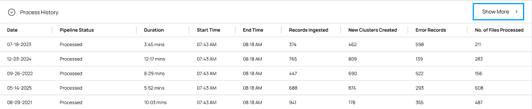
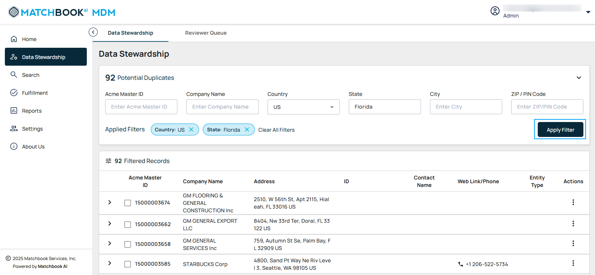
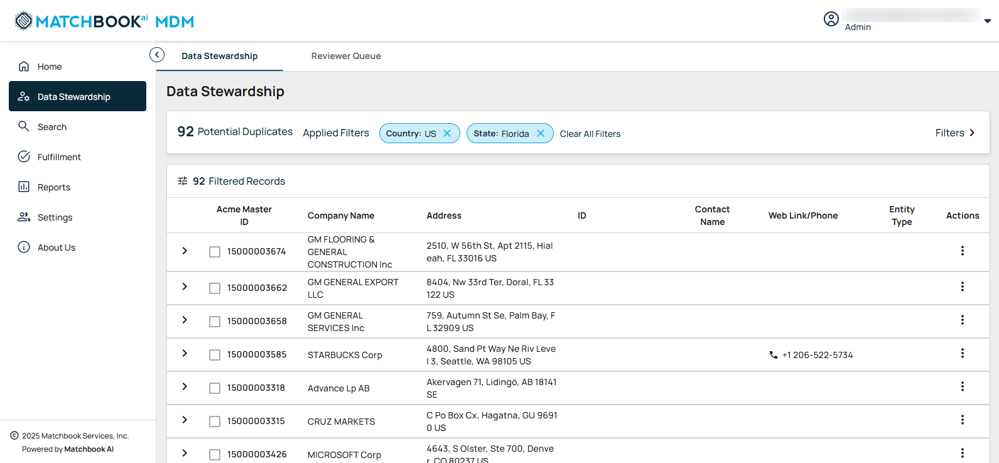

2. Data Stewardship 
---------------------

Data Stewardship ensures high-quality, accurate, and reliable data across an organization. Data Stewards manage data assets, resolve discrepancies, and ensure correct data matching. The process involves evaluating and confirming potential matches, resolving low-confidence records, addressing unmatched data, and verifying final matched records before processing. Navigate to **Data Stewardship** from the left-side menu.

.. figure:: images/15.png

Once you click on **Data Stewardship**, the screen will display two tabs: **Data Stewardship** and **Reviewer Queue**. Click on a tab to switch between the **Data Stewardship** and **Reviewer Queue** sections. 

2.1 Data Stewardship
^^^^^^^^^^^^^^^^^^^^

Data Stewardship helps maintain data accuracy by identifying and resolving duplicate records. When you select the Data Stewardship module, you’ll see key metrics including total records, mastered records, total inputs, and duplicate records for easy and effective monitoring.  
 

.. list-table::
   :header-rows: 1

   * - Field
     - Description
   * - Total Records
     - Displays the total number of records added to the system.
   * - Mastered Records
     - Shows the number of records successfully mastered.
   * - Total Input
     - Represents the total number of records ingested into the system from all input sources, including raw, unprocessed data.
   * - Duplicates
     - Records that are likely duplicates based on matching logic and need validation.

The existing records are displayed in a tabular format: 

.. list-table::
   :header-rows: 1

   * - Field
     - Description
   * - MatchScore
     - A numerical value representing the strength of the match between records based on predefined matching logic.
   * - Matchbook ID
     - A unique identifier assigned to each record by the Matchbook AI system.
   * - Company Name
     - The official name of the organization.
   * - Address
     - The physical location or mailing address of the company.
   * - ID
     - The original or source system identifier for the entity.
   * - Contact Name
     - The full name of the associated individual or point of contact.
   * - Website
     - The company's official website URL.
   * - Phone No
     - The primary contact number for the company or individual.
   * - Entity Type
     - Displays business classification along with an entity type symbol

       * SL - Single Location 

       * BR - Branch 

       * GP - Global Parent

       * DP - Domestic Parent 

       * HQ - Headquarters 

       * PA - Parent

   * - Actions
     - Available options for managing the record, including Merge All, Reject All, and Merge Selected.

To refine data using filters, click on **Filters**. Clicking the **Filters** button expands the filter panel, allowing users to search and filter records based on specific fields.  

To narrow your search, enter the desired company name in the **Company Name** field, and if needed, provide values in other fields for more precise filtering. 

.. figure:: images/18.png

The applied filters will be visible, allowing you to review and verify the filtering criteria used. This helps in refining searches, adjusting if necessary, and ensuring that the displayed data accurately matches the specified conditions. Once all necessary details are entered, click **Apply Filter** to update the results based on your criteria. The system displays a Filtered Entity label above the search results, indicating the total number of records found (e.g., **Filtered Entities- 830**).  If any records match the applied filters, the results will be displayed and the data will appear in a structured format, allowing you to review the relevant records easily.

The results are displayed in a tabular format: 

.. list-table::
    :header-rows: 1

    * - Field
      - Description
    * - MatchScore
      - A numerical value representing the strength of the match between records based on predefined matching logic.
    * - Matchbook ID
      - A unique identifier assigned to the record.
    * - Company Name
      - The legal or official name of the company.
    * - Country
      - The country where the company is located.
    * - State
      - The state or region within the country.
    * - City
      - The city where the company operates or is registered.
    * - Zip code
      - The postal code associated with the company's address.
    * - Match Confidence Score Range
      - Indicates the confidence level of the match based on system logic.
    * - Entity Type
      - Displays business classification along with an entity type symbol.
      
        * SL - Single Location 

        * BR - Branch 

        * GP - Global Parent

        * DP - Domestic Parent 

        * HQ - Headquarters 

        * PA - Parent       

**Note**:  

1. **Matchbook ID** and **ZIP/PIN Code** should contain only numerical values. 

2. Pagination will initially display the first 20 records. Users can click the **“>”** button to view the next 20 records or the **“<”** button to navigate back to the previous 20 records. The system displays **pagination controls** when the number of results exceeds the visible limit, allowing users to navigate between pages and choose the number of records displayed per page. 

3. Users can click on column headers (**MatchScore, MAtchbook ID, Company Name, Address, ID, Contact Name, Website, Phone, Entity Type**) to sort data in ascending or descending order. **Sorting icons** indicate the current sort order. 

4. There is one ID available in the ID column. Users can search for records using this ID. For example: NID (National ID). 

When the results are displayed on the screen, each row will have an “>” symbol (that is expand icon). Clicking the “>” expand icon will expand the row, allowing users to view the **Node Record** along with all unique individual records associated with it. When the **Node Record** is expanded, users can see multiple companies, addresses, and IDs grouped under the record. Record details are grouped and displayed to the user based on the **Rank Order**.

.. figure:: images/19.png

When you click on the three-dot menu for a row, under **Actions** column you will see two options: **Merge** and **Reject**. 

* **Merge**: Allows you to manually choose specific records to merge while leaving others unchanged. 

* **Reject**: Dismisses all suggested duplicates, keeping the records separate. 

2.1.1 Merge
~~~~~~~~~~~

**Merge** is available for **Node Records** in the **Actions** column. Selecting this option merges all unique individual records into the **Node Record cluster**. Any unmerged unique records will be automatically removed from the cluster but may reappear in another cluster. This option is only enabled at the **Node Record** level and is not available for individual unique records. 

Select the checkbox next to individual unique records to begin the process. The system will then display the number of selected records and prompt you to either merge or reject them.

.. figure:: images/20.png

When you click on the **Merge Records** option, a confirmation pop-up window titled "**Confirm Merge Records**" will appear. It contains the message:  

**"You are about to 3 records. Once confirmed all records will be submitted for merge and added to the Reviewer Queue for processing.**

**Matchbook ID 87219365471**

**Company Name Innova Solutions"** 

.. figure:: images/21.png

Selecting **Cancel** will close the pop-up without making any changes (that is without merging). 

Clicking **Confirm and Submit** merges the selected records into the Node Record. The merged records are removed and the **Duplicates** metric is updated accordingly.  A message will appear at the top stating, **"All records have been submitted for merge and added to the Reviewer Queue for processing."**

.. figure:: images/22.png

**Note**: If the user selects only individual unique records **without** selecting the **Node Record**, the system will create a **new cluster** for the selected records and move them to the **Reviewer Queue**, while the existing **Node Record** and its unique records will remain **as-is** on the page. 

If the user selects both the **Node Record** and additional unique records, they will be merged into the **Node Record cluster**, while the remaining unselected unique records will be deleted.

2.1.2 Reject 
~~~~~~~~~~~~

**Reject** is available only for **Node Records** in the **Action** column. Selecting this option removes the entire **Node Record** along with all its associated unique individual records. Users cannot reject individual unique records separately. Once rejected, the **Node Record** and its unique records are eliminated from the current cluster.   

2.2 Reviewer Queue
^^^^^^^^^^^^^^^^^^

The **Reviewer Queue** is where submitted records are placed for final validation after actions like **Merge** and **Reject**. This ensures that data changes are reviewed before being finalized, maintaining integrity and preventing errors. 

Select the **Reviewer** tab to track ongoing processes and their statuses. 

The description of each column is provided in the table below:  

.. list-table::
    :header-rows: 1

    * - Field
      - Description
    * - Type
      - Indicates whether records were merged or unmerged.
    * - Matchbook ID
      - A unique identifier is assigned to each company.
    * - Company Name
      - Official business name of the company.
    * - Address
      - Displays the primary address associated with the entity.
    * - ID
      - Displays relevant business identifiers (e.g., NID).
    * - Web Link
      - The company's official website URL.
    * - Phone
      - The primary contact number for the company or individual.
    * - Time Stamp
      - The date and time of the recorded action.
    * - Initiated By
      - The user who performed the action.
    * - Status
      - Shows the current processing stage of the record (In Queue, Completed, Failed, In Progress).  
        **Note:** When the status is **Failed**, it means there is a conflict with the **Source ID**.
    * - Latest Matchbook ID
      - The most recent identifier assigned after processing.  
        **Note:** The **Latest Matchbook ID** is assigned only when the process is completed.

**Note**:  

1. Users can click on column headers (**Matchbook ID, Company Name, Address etc**) to sort data in **ascending** or **descending** order. **Sorting icons** indicate the current sort order. 

2. All records displayed on the screen will be **locked** in other users when one user is viewing them. However, if the user leaves the **Data Stewardship** page or logs out, the records will be **unlocked**, making them accessible to other users.  

Click on the expand icon to the left of each row to view the records that are set to be merged or unmerged. Now, you will see the records matching the company name are displayed. 

2.2.1 Un Merge  
^^^^^^^^^^^^^^

The **Unmerge** process allows you to separate previously merged records, restoring them to their original state. This is useful when records were merged incorrectly or need to be reviewed separately. When a record is unmerged, it reverts to its original data set. 

