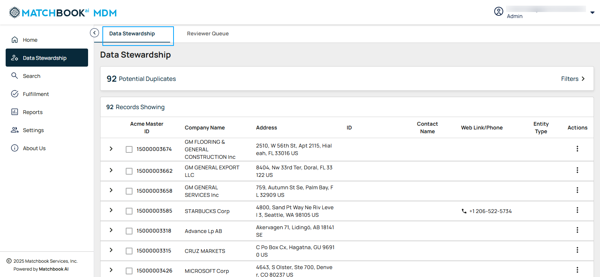
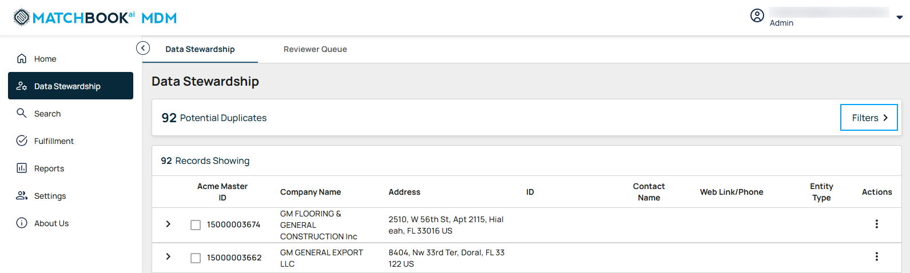
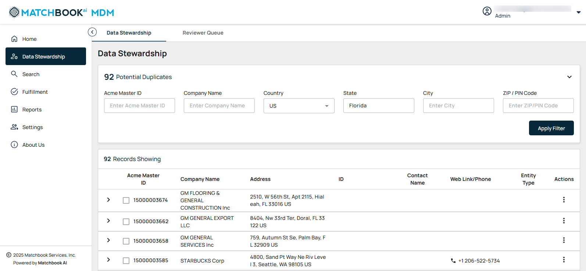
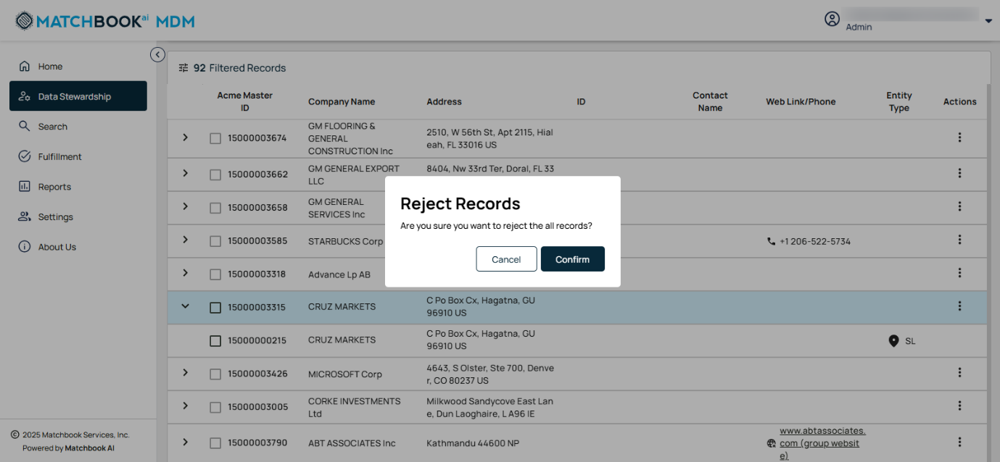
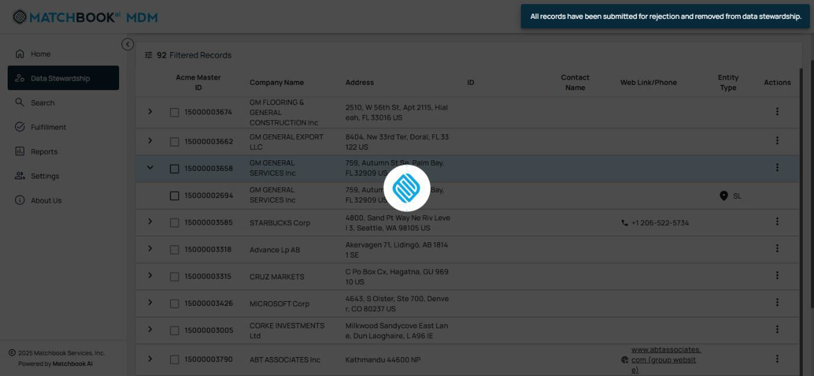
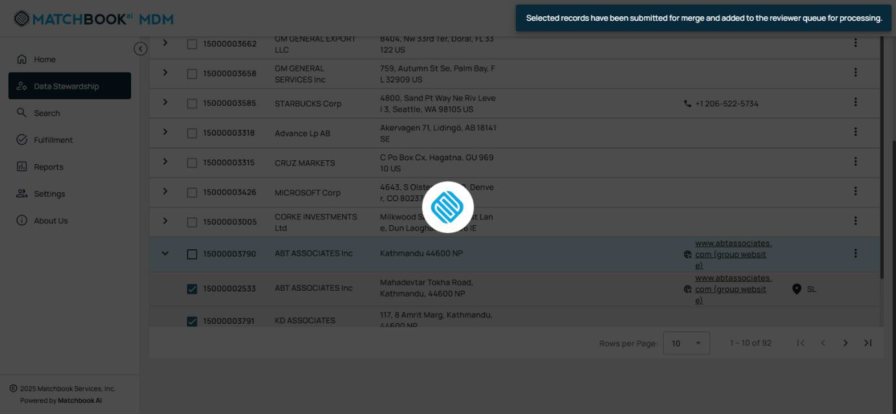

2. Data Stewardship 
---------------------

Data Stewardship ensures high-quality, accurate, and reliable data across an organization. Data Stewards manage data assets, resolve discrepancies, and ensure correct data matching. The process involves evaluating and confirming potential matches, resolving low-confidence records, addressing unmatched data, and verifying final matched records before processing. Navigate to **Data Stewardship** from the left-side menu. 

.. figure:: images/19.png

Once you click on **Data Stewardship**, the screen will display two tabs: **Data Stewardship** and **Reviewer Queue**. Click on a tab to switch between the **Data Stewardship** and **Reviewer Queue** sections.  

2.1 Data Stewardship 
^^^^^^^^^^^^^^^^^^^^^

**Data Stewardship** helps maintain data accuracy by identifying and resolving duplicate records. When you select **Data Stewardship**, you will see potential duplicate records, a **metric card** to effectively monitor data duplication issues. 

The default page will display all **Potential Duplicates** under **Data Stewardship**. 

**Potential Duplicates**- records with similar attributes that may represent the same entity but exist separately due to data entry errors, system migrations, or integrations.

Users can access filters via the **Filters** button in the **Potential Duplicates** metric section. Clicking the **Filters** button expands the filter panel, allowing users to search and filter records based on specific fields.  

To refine data using filters, click on **Filters**, as shown in the screen below.  

This will display a list of available fields, including **Acme Master ID, Company Name, Country, State, City, and Zip/PIN Code**. To narrow your search, enter the desired company name in the **Company Name** field, and if needed, provide values in other fields for more precise filtering. 

**Note**:  

1. **Acme Master ID** and **ZIP/PIN Code** should contain only numerical values. 

2. Pagination will initially display the first 20 records. Users can click the **“>”** button to view the next 20 records or the **“<”** button to navigate back to the previous 20 records. The system displays **pagination controls** when the number of results exceeds the visible limit, allowing users to navigate between pages and choose the number of records displayed per page. 

The applied filters will be visible, allowing you to review and verify the filtering criteria used. This helps in refining searches, adjusting if necessary, and ensuring that the displayed data accurately matches the specified conditions.  

Once all necessary details are entered, click **Apply Filter** to update the results based on your criteria. 

.. figure:: images/23.png

The system displays a **Record Count** label above the search results, indicating the total number of records found (e.g., **92 Filtered Records**).   

The table below provides a description of each column:  

.. list-table::
    :header-rows: 1

    * - Field
      - Description
    * - Acme Master ID
      - A unique identifier assigned to each merged company.
    * - Company Name
      - Official business name of the merged company.
    * - Address
      - Displays the primary address associated with the entity.
    * - ID
      - Displays relevant business identifiers. For example: NationalID (NID), Registration ID (RN ID), Financial ID (FID).
    * - Contact Name
      - Shows the primary contact person’s name (if available).
    * - Web Link/ Phone
      - Displays the company’s website and phone number.
    * - Entity Type
      - Displays business classification along with an entity type symbol 

        * SL - Single Location

        * BR - Branch 

        * GP - Global Parent

        * DP - Domestic Parent

        * HQ - Headquarters
        
        * PA - Parent

    * - Actions
      - Available options for managing the record.

       * Merge all 

       * Reject All  

       * Merge Selected

**Note**: Users can click on column headers (**Acme Master ID, Company Name, Address, ID, Contact Name, Web Link/Phone, Entity Type**) to sort data in ascending or descending order. **Sorting icons** indicate the current sort order.  

If any records match the applied filters, the results will be displayed and the data will appear in a structured format, allowing you to review the relevant records easily.

.. figure:: images/24.png

If no matching records are found, a message will indicate that no results are available, prompting you to refine your filter criteria if needed.   

When the results are displayed on the screen, each row will have an “>” symbol (that is expand icon). Clicking the “>” expand icon will expand the row, allowing users to view the **Node Record** along with all unique individual records associated with it. When the **Node Record** is expanded, users can see multiple companies, addresses, and IDs grouped under the record. Record details are grouped and displayed to the user based on the **Rank Order**. 

.. figure:: images/25.png

There are three different IDs available in the ID column. Users can search for records using any of these three IDs as shown in the screen below. For example: National ID, RN ID, Financial ID. 

When you click on the three-dot menu for a row, under **Actions** column you will see three options: **Merge All**, **Reject All**, and **Merge Selected**. 

.. figure:: images/26.png

* **Merge All**: Combines all identified duplicate records into a single record. 

* **Reject All**: Dismisses all suggested duplicates, keeping the records separate. 

* **Merge Selected**: Allows you to manually choose specific records to merge while leaving others unchanged. 

**Note**: The "**Merge All**" and "**Reject All**" options will be enabled only for **Node Records**.  

*2.1.1 Merge All* 
""""""""""""""""

**Merge All** is available for **Node Records** in the **Actions** column. Selecting this option merges all unique individual records into the **Node Record cluster**. Any unmerged unique records will be automatically removed from the cluster but may reappear in another cluster. This option is only enabled at the **Node Record** level and is not available for individual unique records. 

When you click on the **Merge All** option, a confirmation pop-up window titled "**Merge All Records**" will appear. It contains the message: "**Are you sure you want to merge all related records?**" 

.. figure:: images/27.png

Selecting **Cancel** will close the pop-up window without making any changes (that is without merging).  

Clicking "**Confirm**" merges the selected records into the Node Record. The merged records are removed from the **Potential Duplicates** queue, and the **Potential Duplicates** metric is updated accordingly.  A message will appear at the top stating, "**All records have been submitted for merge and added to the Reviewer Queue for processing**." 

.. figure:: images/28.png

**Note**: If the user selects only individual unique records **without** selecting the **Node Record**, the system will create a **new cluster** for the selected records and move them to the **Reviewer Queue**, while the existing **Node Record** and its unique records will remain **as-is** on the **Potential Duplicates** page. 

If the user selects both the **Node Record** and additional unique records, they will be merged into the **Node Record cluster**, while the remaining unselected unique records will be deleted. 

*2.1.2 Reject All* 
""""""""""""""""""

**Reject All** is available only for **Node Records** in the **Action** column. Selecting this option removes the entire **Node Record** along with all its associated unique individual records. Users cannot reject individual unique records separately. Once rejected, the **Node Record** and its unique records are eliminated from the current cluster.  

Under the **Actions** column, click on the three-dot menu for a row and select **Reject All**. This will remove all identified duplicate records from the Data Stewardship process.  

.. figure:: images/29.png

Selecting "**Reject All**" triggers a confirmation pop-up titled "**Reject All Records**" will appear. It contains the message: "**Are you sure you want to reject all records?**"

Clicking "**Cancel**" dismisses the pop-up and retains all records in the **Potential Duplicates** tab. 

Clicking "**Confirm**" removes the selected records from the **Potential Duplicates** list. A confirmation message will appear, stating that the records have been submitted for rejection and will no longer be considered for merging. The message will read, "**All records have been submitted for rejection and removed from data stewardship**."

*2.1.3 Merge Selected*
""""""""""""""""""""""
 
**Merge Selected** is enabled when the user selects one or more unique individual records within a **Node Record**. The selected records will be merged into the **Node Record cluster**, while unselected records will remain in the cluster. If the selected records are not merged with the **Node Record**, they will form a new cluster, and the remaining records will stay under the original **Node Record**. This option is only available at the **Node Record** level and cannot be used for individual unique records alone.  

To proceed, check the boxes next to the records you want to merge. Once selected, click on the three-dot menu for a row and select **Merge Selected**.  

**Use case 1: Here, node record is not selected**. 

A confirmation pop-up window will appear, prompting you to confirm or cancel the merge process.  

.. figure:: images/33.png

If you **Cancel**, no changes will be made.  

If you click on **Confirm**, only the selected records will be merged, and a message will appear stating “**Selected records have been submitted for merge and added to the reviewer queue for processing**”.  

Now, try searching for records using the **Acme Master ID** in the designated field. The results will be displayed based on the action you previously selected— **Merge All**, **Reject All**, or **Merge Selected**. 

* If you selected **Merge All**, all identified duplicates will be combined into a single record, and only the merged record will appear in the results. 

* If you choose **Reject All**, the records will be removed from Data Stewardship and will no longer be visible. 

* If you used **Merge Selected**, only the specifically chosen records will be merged, while the unselected records will remain as separate entries in the results. 

**Use case 2: Here, the node record is selected**. 

You can proceed with the desired action on the selected record. 

A confirmation pop-up window will appear, prompting you to confirm or cancel the merge process. 

If you **Cancel**, no changes will be made.  

If you click on **Confirm**, only the selected records will be merged, and a message will appear stating **“Selected records have been submitted for merge and added to the reviewer queue for processing”**. 

If you try to search the records by the **Acme Master ID**, a message will appear saying **“No potential duplicates or matches found for this record”**.

2.2 Reviewer Queue 
^^^^^^^^^^^^^^^^^^^

The **Reviewer Queue** is where submitted records are placed for final validation after actions like **Merge All**, **Reject All**, or **Merge Selected**. This ensures that data changes are reviewed before being finalized, maintaining integrity and preventing errors. 

Select the **Reviewer** tab to track ongoing processes and their statuses.  

The description of each column is provided in the table below:  

.. list-table::
    :header-rows: 1

    * - Field
      - Description
    * - Type
      - Indicates whether records were merged or unmerged.
    * - Acme Master ID
      - A unique identifier assigned to each merged company.
    * - Company Name
      - Official business name of the merged company.
    * - Address
      - Displays the primary address associated with the entity.
    * - ID
      - Displays relevant business identifiers (e.g., NID, RID etc).
    * - Time Stamp
      - The date and time of the recorded action.
    * - Initiated By
      - The user who performed the action.
    * - Status
      - Shows the current processing stage of the record (In Queue, Completed, Failed, In Progress).  
        **Note**: When the status is **Failed**, it means there is a conflict with the **Source ID**.
    * - Latest Acme Master ID
      - The most recent identifier assigned after processing.  
        **Note**: The **Latest Acme Master ID** is assigned only when the process is completed.

*2.2.1 Merge* 
""""""""""""""
If any records are selected for merging or unmerging, the **Queue Status** section on the top includes the following statuses: **Completed, In Queue, In Progress**, and **Failed**. The metric for each status will be displayed within the **Queue Status** section, providing users with a clear overview of the record processing status (e.g., **12 Completed, 26 In Queue, 0 In Progress, 2 Failed**).  

**Note**:  

1. Users can click on column headers (**Acme Master ID, Company Name, Address**) to sort data in **ascending** or **descending** order. **Sorting icons** indicate the current sort order. 

2. All records displayed on the screen will be **locked** for other users when one user is viewing them. However, if the user leaves the **Data Stewardship** page or logs out, the records will be **unlocked**, making them accessible to other users.  

Click on the expand icon to the left of each row to view the records that are set to be merged or unmerged. 

Now, you will see the records matching the company name are displayed. 

Clicking on the Acme Master ID will redirect you to a new page displaying the company details. The **Included Companies** tab shows the number of companies associated with that ID. 

The **Included Companies** tab displays a structured table with the following columns: 

.. list-table::
    :header-rows: 1

    * - Field
      - Description
    * - Acme Master ID
      - A unique identifier assigned to each merged company.
    * - Company Name
      - The official business name of the merged company.
    * - Address
      - Displays the primary address associated with the entity.
    * - ID
      - Displays relevant business identifiers (e.g., NID, RID, FID).
    * - Contact Name
      - Shows the primary contact person’s name (if available).
    * - Web Link/Phone
      - Displays the company’s website and phone number.
    * - Entity Type
      - Indicates the business classification along with an entity type symbol:  
        * SL - Single Location  
        * BR - Branch  
        * GP - Global Parent  
        * DP - Domestic Parent  
        * HQ - Headquarter  
        * PA - Parent
    * - Actions
      - Provides an "Unmerge" option to remove an entity from the master record. Visible only for Data Steward Users.

*2.2.2 Un Merge*  
""""""""""""""""

The **Unmerge** process allows you to separate previously merged records, restoring them to their original state. This is useful when records were merged incorrectly or need to be reviewed separately. When a record is unmerged, it reverts to its original data set.  

**Note**: When there are no companies associated with the records, a message or an empty results screen will be displayed, indicating that no matching records were found.  

Clicking on the **Acme Master ID** will redirect you to a new page displaying the company details. The Included Companies tab shows the number of companies associated with that ID.  

If companies are associated and records are displayed, click on the **Unmerge** icon under the **Actions** column beside the record, as shown in the screen below.  

Once you click on the **Unmerge** icon, a pop-up window titled **"Un-Merge Record"** will appear, prompting you with the message: **"Are you sure you want to unmerge this record?"** You can then cancel or confirm the unmerge action.   

Selecting the **Cancel** button closes the pop-up window without saving any changes.  

When you select the **Confirm** button, a message will appear stating, "**The selected record has been queued for Unmerge**."      

**Note**: To perform an **Unmerge** action, a minimum of two records must be present. If the cluster contains only two records and the user performs an unmerge, the **Node Record** will be deleted and will no longer appear in the **Search** or **Data Stewardship pages**. Instead, the child record will be created as a unique individual record. Upon successful unmerge, the removed record will no longer appear on the **View Details** page, and the unmerged child records will be moved to the **Data Stewardship** table.  
 
This record will be moved to **Reviewer Queue** screen as shown below, you can see that the record status is **In Queue**. 

Now, you can see that the status has changed to **Completed**, indicating that the **Unmerge** process has been successfully executed. The previously merged records have been separated and restored to their original state.  

If you search using the Internal ID, any previously merged records will no longer appear as a single entry.    

Instead, they will be separated into their original records, reflecting the **Unmerge** action. Upon successful unmerge, the removed record will no longer appear on the **View Details** page, and the unmerged child records will be moved to the **Data Stewardship** table as shown below.  

2.3 Lock Records  
^^^^^^^^^^^^^^^^^

**Note**:  

**Use case 1**: When we search by Internal ID, if a **Node Record** is being viewed by one user, it will be **locked** for other users, and the checkboxes for unique records under the **Node Record** will be **greyed out**. A **warning message** will be displayed to notify users: **"Your search includes 1 record(s) currently being viewed by other users."**

**Use case 2**: If we search for records using filters like Company Name and State, the results will display with the message: **“Your search returns 378 records. 20 records are currently locked and not displayed, as they’re being viewed by another user.”** (With the company name and state selected, if there are 378 records, the first 20 records will be displayed based on the pagination settings. These 20 records will not be visible to other users).  

However, if the user leaves the **Data Stewardship** page or logs out, the records will be **unlocked**, making them accessible to other users. 

