4. Fulfilment
---------------

Fulfillment refers to the process of ensuring that all requested operations, such as data matching, record processing, or service delivery, are completed accurately and efficiently. It plays a crucial role in streamlining workflows and meeting user requirements. Navigate to **Fulfilment** and select **Bulk Match** from the left-side menu.

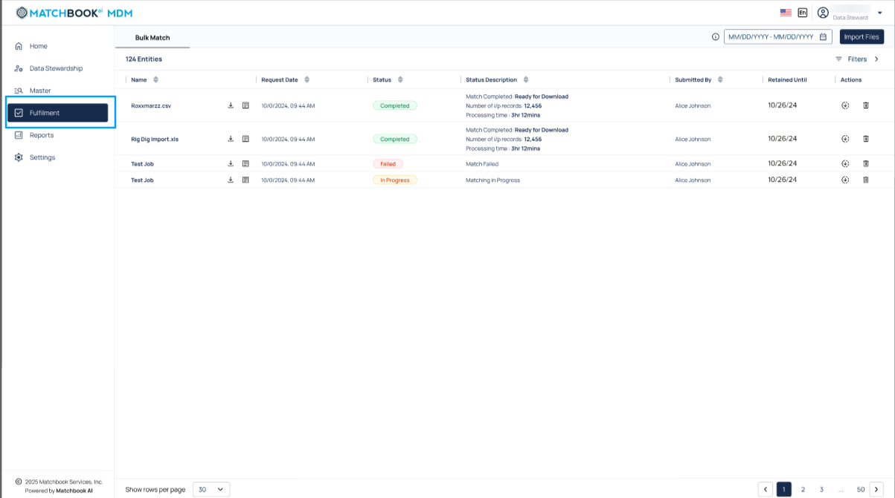

4.1 Bulk Match
^^^^^^^^^^^^^^

The **Bulk Match process** enables users to upload large datasets and automatically match them against existing master data using predefined rules. It helps identify duplicates, inconsistencies, and potential links between incoming and mastered records. This process is ideal for onboarding new data sources, integrating legacy systems, and cleansing high-volume data. By automating matching at scale, it ensures accurate, standardized data is ready for fulfilment to downstream systems. 

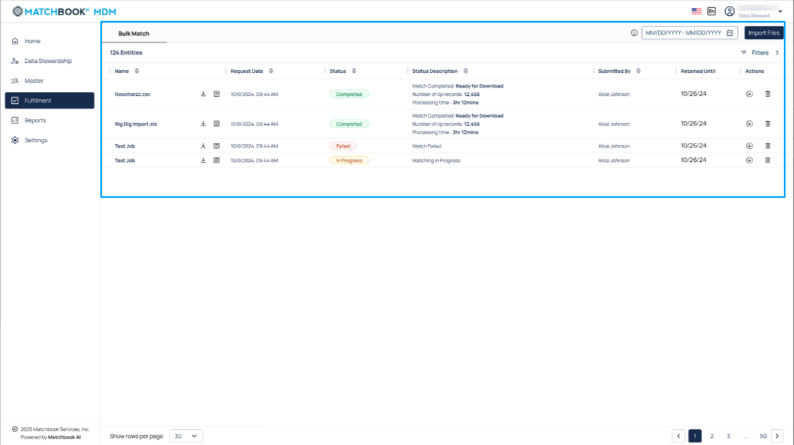

**Use Case**: The **Bulk Match** feature enables users to submit company data via API or file upload and automatically match it against the master database. It returns validated, enriched results by identifying exact or potential matches, helping teams verify data, remove duplicates, and standardize records at scale.  

The Bulk Match page will display a table showing the uploaded files along with their current statuses, providing a clear overview of the matching process and progress for each file. 

.. list-table::
   :header-rows: 1

   * - Field
     - Description
   * - Name
     - The unique identifier or title of the dataset being processed.
   * - Request Date
     - The date when the request for processing was initiated or submitted.
   * - Status
     - The current processing status of the operation (e.g., Pending, In Progress, Completed).
   * - Status Description
     - A brief explanation or additional details about the current status of the operation.
   * - Submitted By
     - The user or system that submitted the request for processing.
   * - Retained Until
     - The date until which the data or results are kept or accessible in the system.
   * - Actions
     - The available operations that can be performed under actions are download and delete.

To upload files, click the **Import File** button.

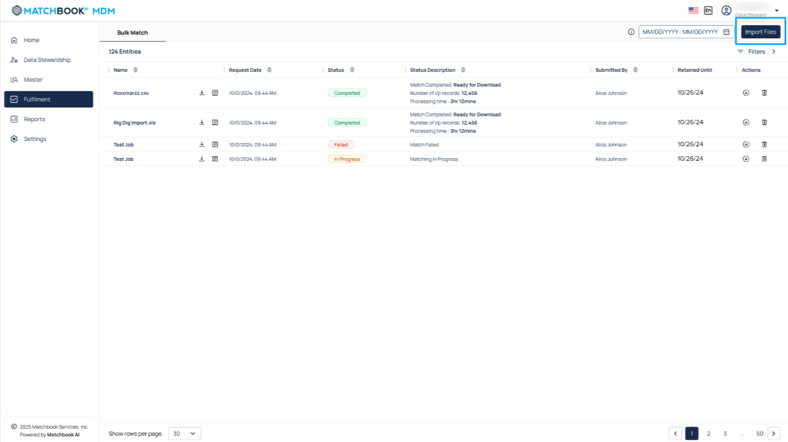

*4.1.1 Import File*
""""""""""""""""""

A new pop-up window opens, select the **.csv** file which is a raw file and upload it by clicking on **Browse** button. 

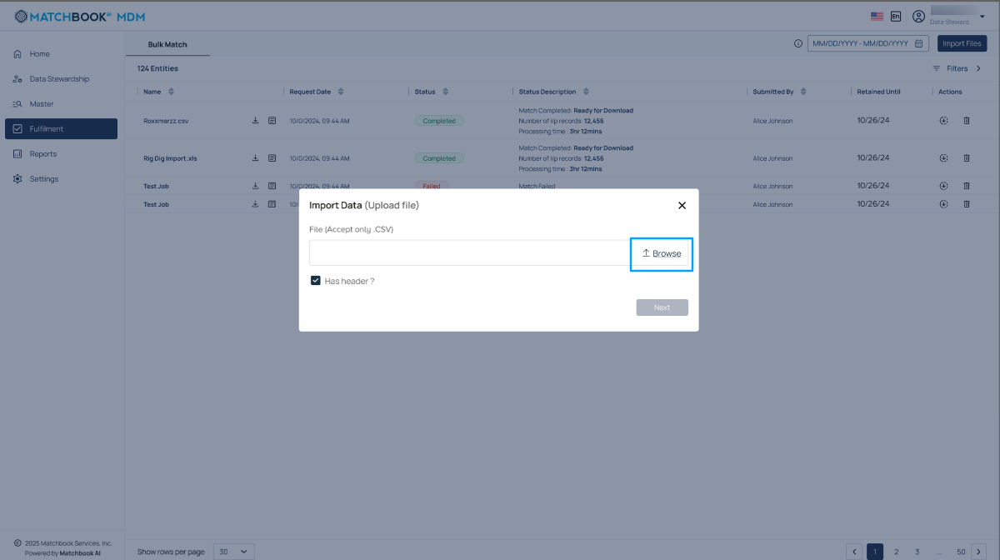

Specify whether the source file contains headers by checking the **Has Header** checkbox. This lets the system know that the data mapping is to be performed from the 2nd row. By default, **Has Header** check box is checked. 

**Note**: If **Has Header** checkbox is not selected then the data mapping is to be performed from the 1st row. 

Click on **Next**. This process allows you to easily import data into the system for further processing. 

.. figure:: images/31-5.png

*4.1.2 Match Settings* 
""""""""""""""""""""

This allows users to define and customize thresholds, limits, and data retention rules to optimize matching processes and prioritize tasks efficiently. 

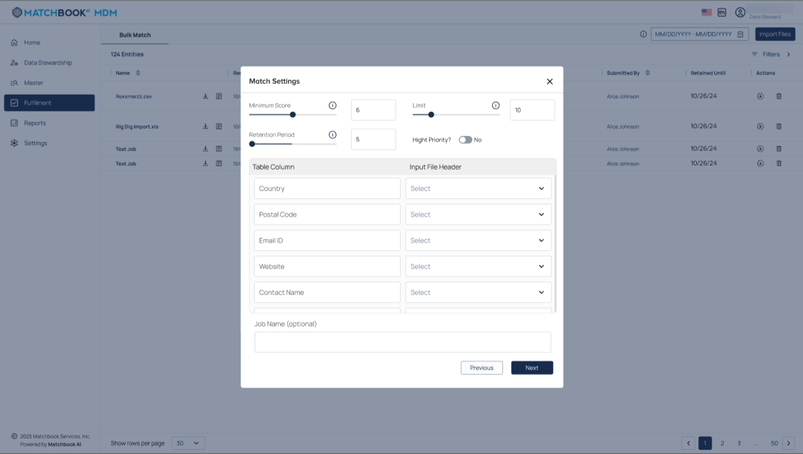

The table below provides descriptions of the match settings options listed above; 

.. list-table::
   :header-rows: 1

   * - Field
     - Description
   * - Minimum Score
     - The lowest matching confidence score required to consider a record as a match.
   * - Retention Period
     - The duration for which the matched data will be stored in the system.
   * - Limit
     - The maximum number of records allowed per bulk match request.
   * - High Priority
     - An option to prioritize the processing of the bulk match job.
   * - Source Record ID
     - A unique identifier for the original record submitted for matching.
   * - Company Name
     - The official registered name of the company or entity.
   * - Street
     - The street address of the company as submitted in the input.
   * - City
     - The city associated with the company’s address.
   * - State
     - The state or region specified in the company’s address.

Scroll down to view additional match settings options. 

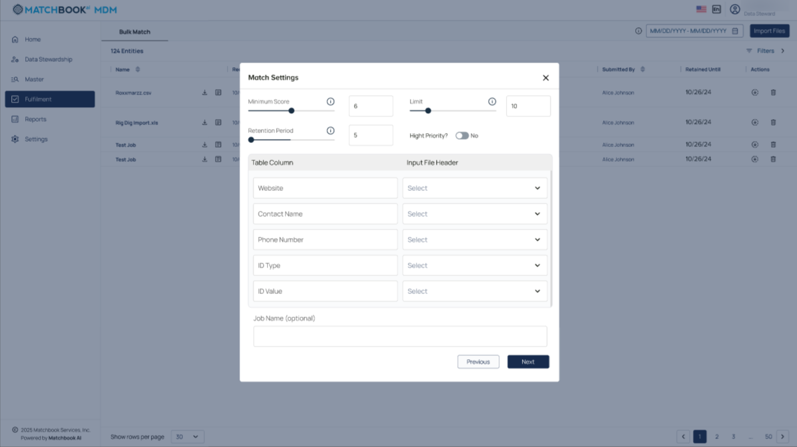

The table below provides descriptions of the match settings options listed above; 

.. list-table::
   :header-rows: 1

   * - Field
     - Description
   * - Country
     - The country associated with the company’s address.
   * - Postal Code
     - The postal or ZIP code provided in the company’s address.
   * - Email ID
     - The email address linked to the company or contact person.
   * - Website
     - The company's official website URL.
   * - Contact Name
     - The name of the primary contact person associated with the company.

Scroll down to view the remaining match settings options. 

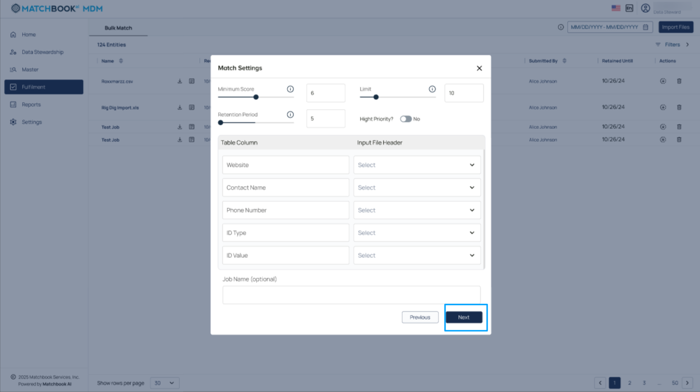

The table below provides descriptions of the match settings options listed above; 

.. list-table::
   :header-rows: 1

   * - Field
     - Description
   * - Website
     - The company's official website URL.
   * - Contact Name
     - The name of the primary contact person associated with the company.
   * - Phone Number
     - The primary contact number for the company.
   * - ID Type
     - One or more unique identifiers associated with the entity.

       List of Identifiers:
       - National ID (NID)
       - Account ID (AID)
       - Customer ID (CID)
       - Finance ID (FID)
       - Supplier ID (SID)
       - Registration Number
       - DUNS No

       **Note**: There could be multiple IDs from different sources.
   * - ID Value
     - The actual value of the identification number corresponding to the ID Type.
   * - Job Name (Optional)
     - A user-defined label to identify or describe the matching job (optional field).

After you click on **next**

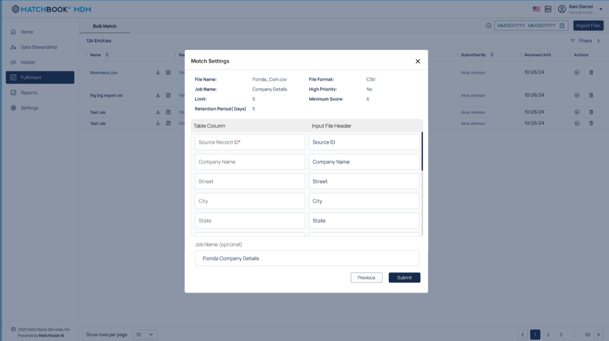

A new window opens with the details you have already entered. 

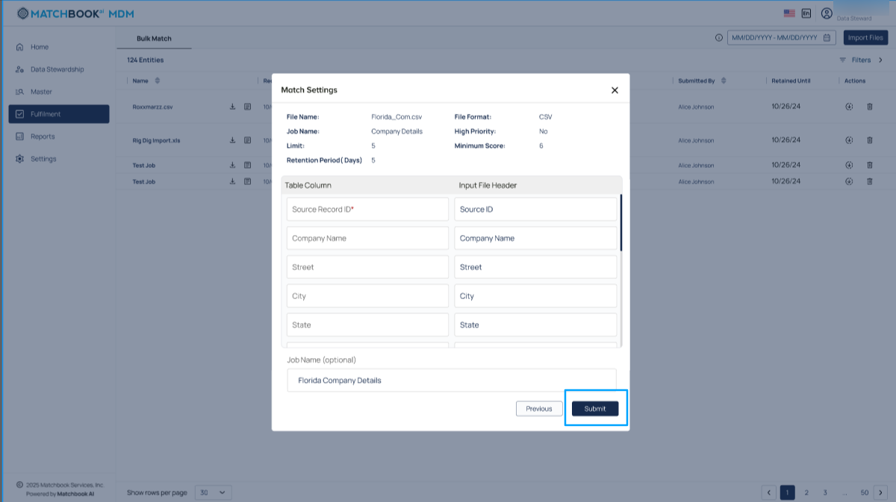

The table below shows the description of the following details; 

.. list-table::
   :header-rows: 1

   * - Field
     - Description
   * - File Name
     - The name of the file uploaded for the bulk match process. (ex: Florida_Com.csv) 
   * - Job Name
     - A custom label assigned to identify the bulk match job. (ex: Company Details).
   * - Limit
     - Specifies the maximum number of records allowed in the uploaded file. (ex: 5) 
   * - Retention Period (Days)
     - Defines how many days the matched data will be retained in the system. (ex: 5) 
   * - File format
     - Indicates the type of file uploaded(ex: CSV) 
   * - High Priority
     - Option to mark the job for faster processing. 
       (ex: Yes/No) Such as here-No 
   * - Minimum Score
     - The threshold match score required for a record to be considered a valid match. (ex: 6) 

Click on the **Submit** option, a screen appears showing the file upload in progress. 

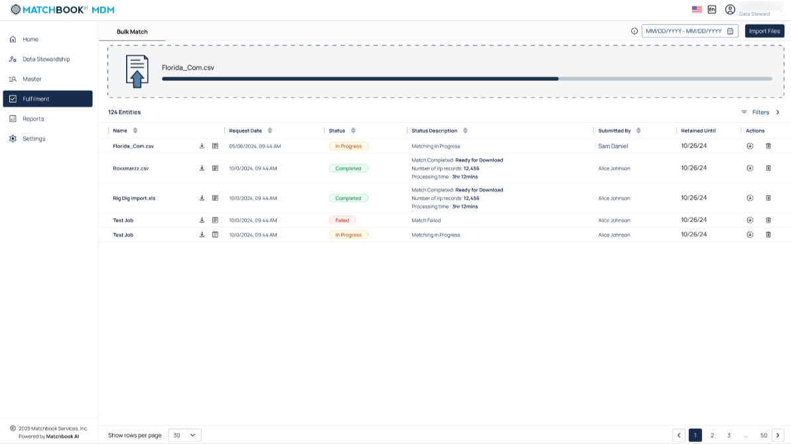

A success message is displayed after the file is successfully imported.  

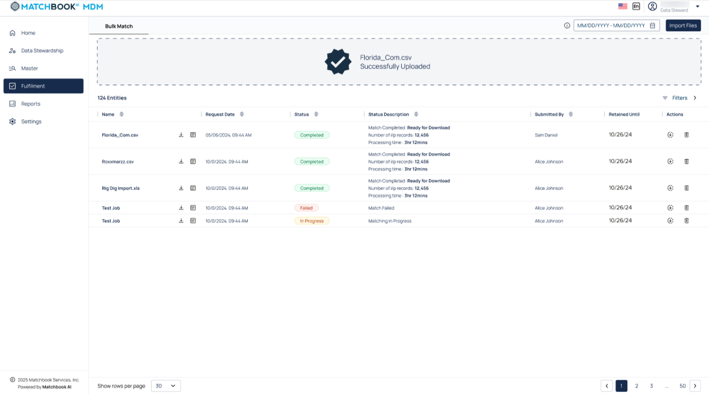

* You can use the **Download** button to retrieve processed files (.csv) that are matched with given parameters.  

* The **View Details** icon lets users access logs and match statistics for a specific Bulk Match job. It’s useful for reviewing results or troubleshooting issues. 

The screen below displays the options for **Download** and **View Details**. 

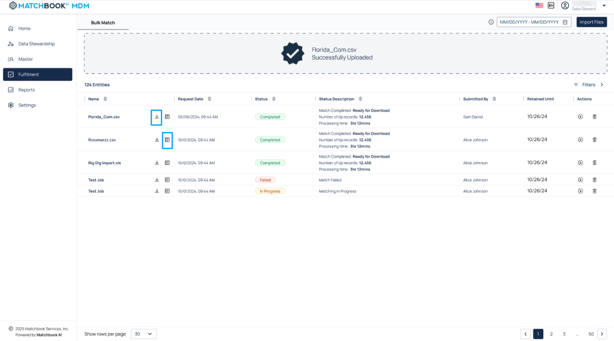

