4. Fulfilment 
---------------

Fulfillment refers to the process of ensuring that all requested operations, such as data matching, record processing, or service delivery, are completed accurately and efficiently. It plays a crucial role in streamlining workflows and meeting user requirements. Navigate to **Fulfilment** section from the left-side menu. 

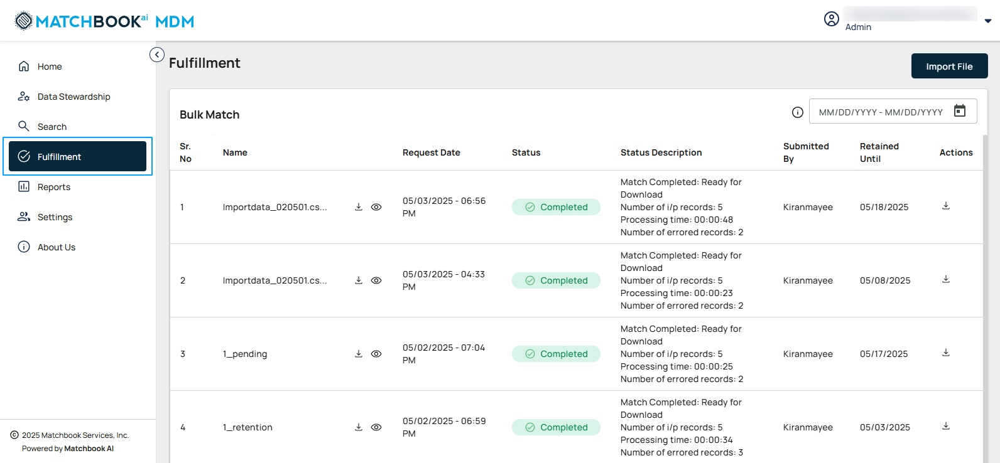

4.1 Bulk Match 
^^^^^^^^^^^^^^^

Bulk Match is an essential part of the fulfillment process, designed to efficiently manage large-scale matching requests. This feature allows users to submit multiple records simultaneously, enabling streamlined processing, detailed tracking, and effective management of each request. The Bulk Match process involves comparing input data against our master database to provide accurate matches. 

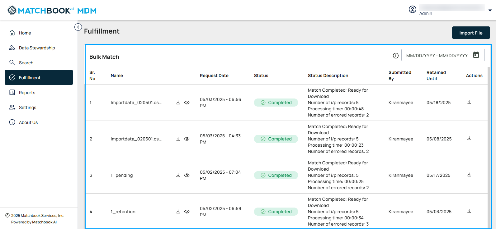

**Use Case**: The Bulk Match API helps identify and retrieve information from the master database based on the data provided. For example, if a user submits DELL or a list of company names, the system compares the input against the master data and returns the relevant information. This allows users to see all matched results for the records they provide, enabling data validation and enrichment. 

The Bulk Match page will display a table showing the uploaded files along with their current statuses, providing a clear overview of the matching process and progress for each file.  

The table below gives the description of each column: 

.. list-table::
    :header-rows: 1

    * - Field
      - Description
    * - Sr.No
      - Sequential identifier for each request.
    * - Name
      - The title or identifier of the request.
    * - Request Date
      - The date the request was made.
    * - Status
      - Current state of the request (e.g., Pending, Completed).
    * - Status Description
      - Detailed explanation of the current status.
    * - Submitted By
      - The user who initiated the request.
    * - Retained Until
      - The user defines the date by which the matched data will be retained.
        **Note**: By default, the data is available for download up to 60 days.
    * - Actions
      - The match results are the processed files that are available for download.

*4.1.1 Filter a date Range* 
""""""""""""""""""""""""""

Select a date range to view the processed files within a specific period. Select the calendar button on the right and enter a date range in the field provided.  

Click **Apply**.

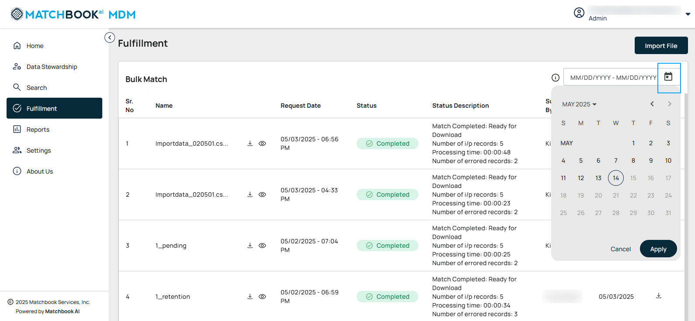

*4.1.2 Import File*
""""""""""""""""""

To upload files, click the **Import File** button. 

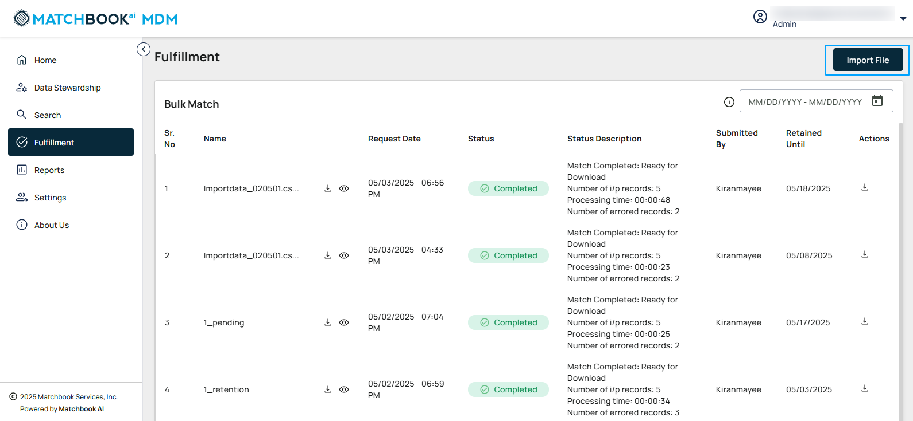

A new pop-up window opens, select the **.csv** file which is a raw file and upload it by clicking on **Browse** button. 

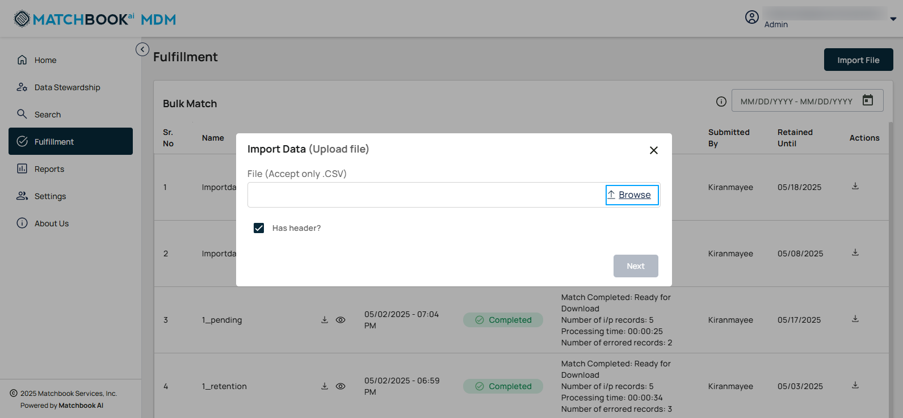

Specify whether the source file contains headers by checking the **Has Header** checkbox. This lets the system know that the data mapping must be performed from the 2nd row. By default, **Has Header** check box is checked. 

**Note**: If **Has Header** checkbox is not selected then the data mapping is performed from the 1st row.  

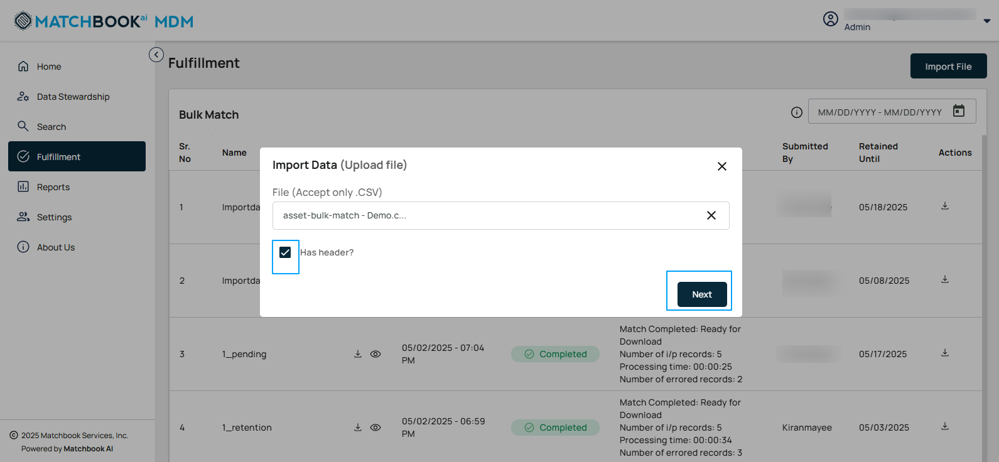

Click on **Next**. This process allows you to easily import data into the system for further processing. 

*4.1.3 Match Settings* 
""""""""""""""""""""""

This allows users to define and customize thresholds, limits, and data retention rules to optimize matching processes and prioritize tasks efficiently.  

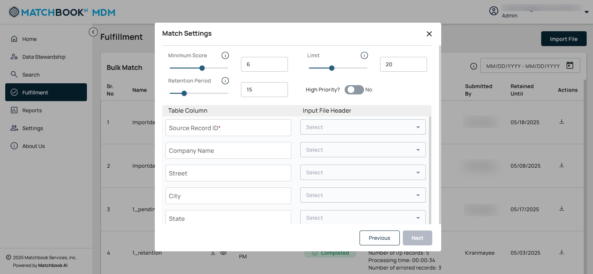

.. list-table::
    :header-rows: 1

    * - Field
      - Description
    * - Minimum Score
      - The minimum threshold score required to qualify for a match. A slider and a text box with a default value of 6. The slider shall allow users to select values between 1 and 10. The text box shall accept numeric inputs only.
    * - Limit
      - The maximum number of matches or results allowed. A slider and a text box with a default value of 20. The slider shall allow users to select values between 1 and 50. The text box shall accept numeric inputs only.
    * - Retention Period
      - The time-period for retaining match data before it is purged. A slider and a text box with a default value of 15. The slider shall allow users to select values between 1 and 60 days. The text box shall accept numeric inputs only.
    * - High Priority
      - Based on the user role, the file which is marked as high priority will be picked up first in the queue. This can be set up by switching between the toggle to **Yes** or **No**.

Under **Column Mapping**, there are two columns: **Table Column** and **Input File Header**. 

**Column Mapping**: Column mapping ensures the accurate alignment of data fields between an input file and the database table, facilitating reliable data transfer and processing. Each column in the table corresponds to a header in the input file. The uploaded file for matching follows specific parameters, and the system automatically generates all records that match those criteria.  

**Note**: For perfect match, **Source Record ID** and at least 1 more parameter under the column mapping is mandatory (For this use case, Source Record ID and Company Name are selected). 

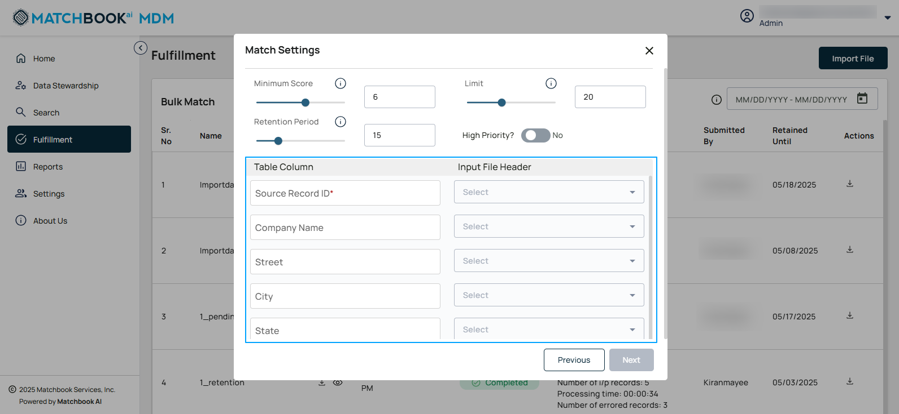

All the fields under the **Input File Header** column has a drop-down menu with various options (for example, SrcRecordID, Manufacturer, and Model), selecting one will automatically update for data mapping.  

Scroll down to find **Job Name** (**optional**), where the user can optionally assign a job name to the .csv file import.  

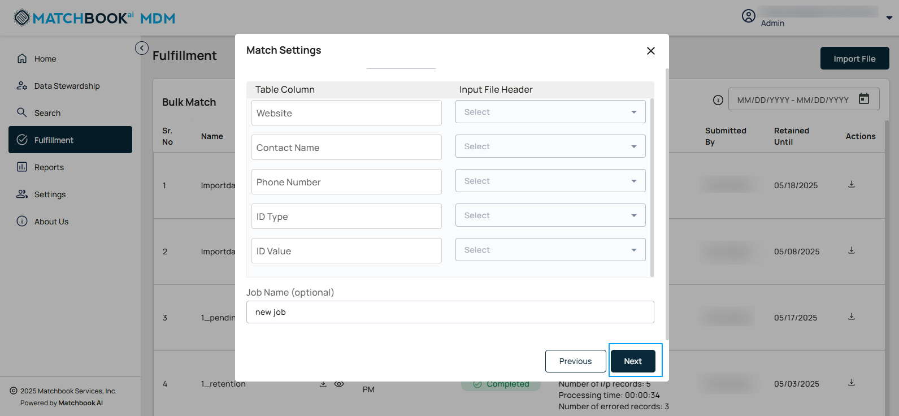

Once mapped, click **Next**. 

All the details are displayed for review in the **Review Settings** (**Match Settings**) pop-up window.

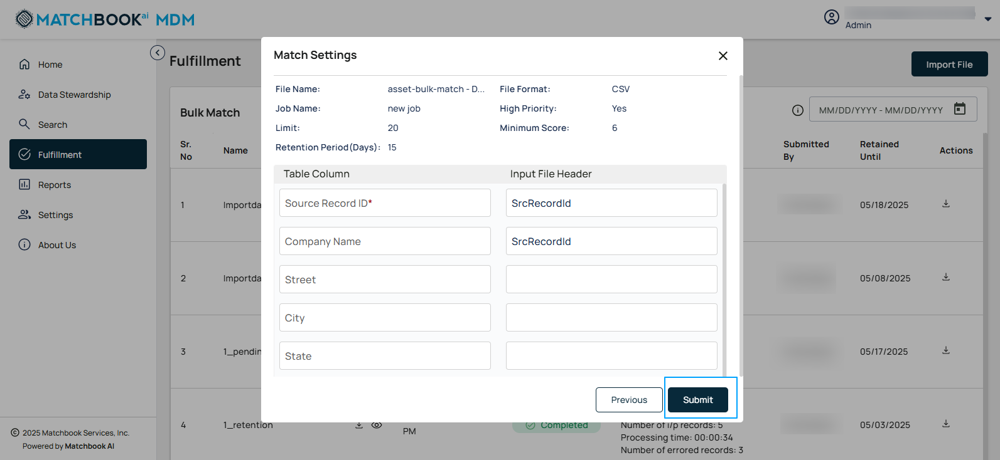

**Note**: If the user wants to edit any setting, click on **Previous** button.  

Otherwise, click **Submit**.  

You can see the file is downloading. 

A success message is displayed upon the successful import of the file. 

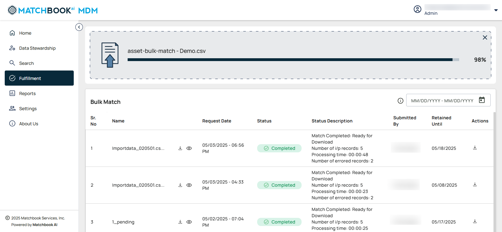

You can use the **Download** button under **Actions** column to retrieve processed files (.csv) that are matched with given parameters. 

Click on the **information** button next to the Name of the Bulk match in each row.

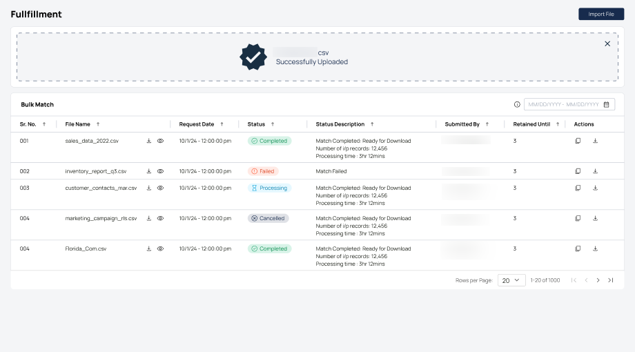

A pop-up window opens, displaying the information about the file. 

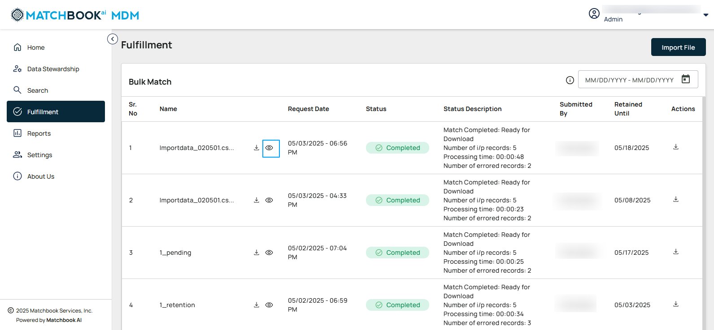

