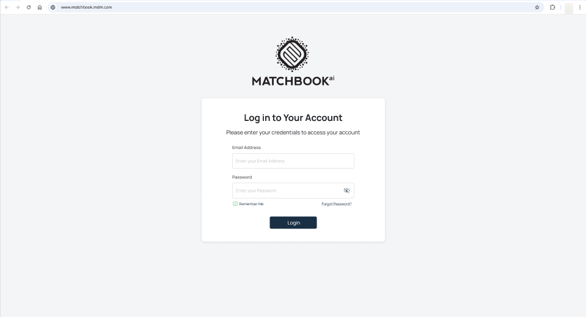
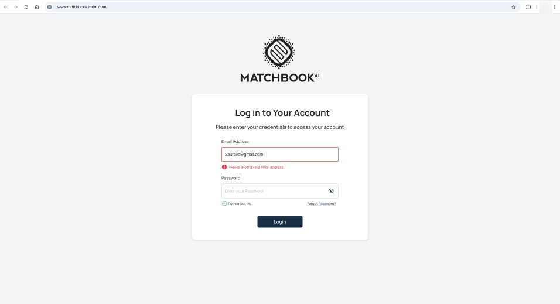
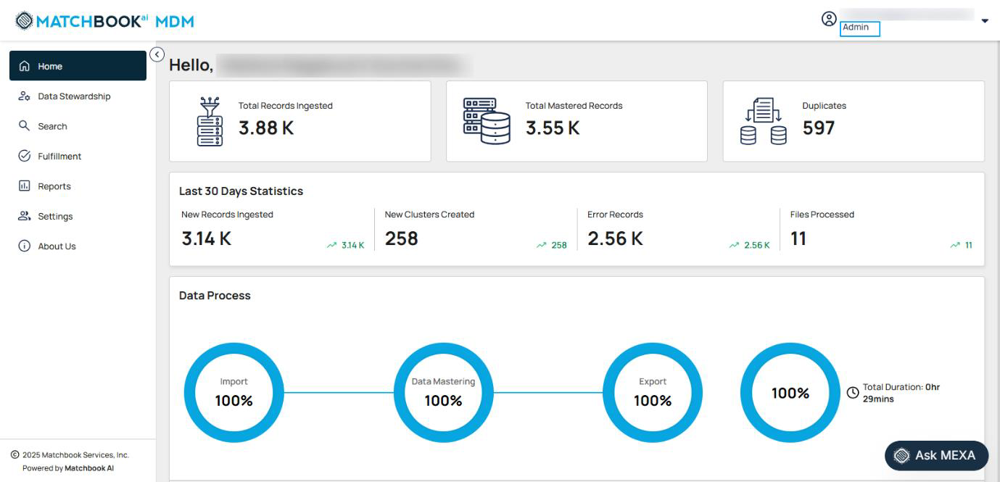
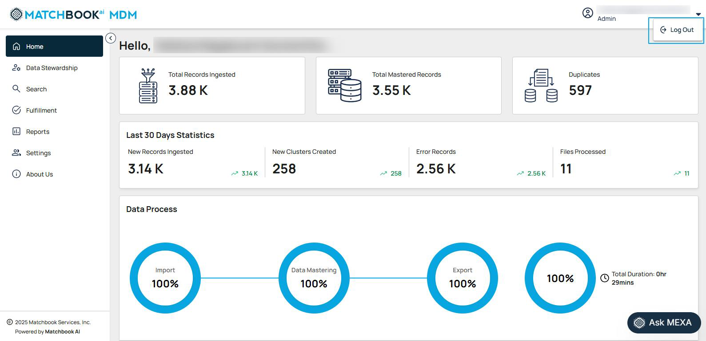
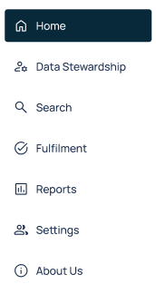

Getting Started
=================

The Dashboard is the default landing page for the MDM application, providing a comprehensive overview of platform activities. Some general troubleshooting instructions have been given below:

1.	To access the MDM platform, open your web browser and navigate to this designated URL . This URL directs you to the MDM user interface, where you can log in, manage users, configure settings, and perform other administrative tasks based on your assigned role and permissions. 

2.	Entering an email address is mandatory. If you attempt to log in without providing one, a message will appear stating, '**The Email Address field is required**'. Ensure you enter both your email address and password in the provided fields before proceeding. 

3.	You must enter a valid email address; otherwise, a message will appear stating, **“The email address is not registered"** on the top right corner. 

Then, click the **Login** button to access your account. 

4.	If you’ve forgotten your password, click the **Forgot Password?** link on the login screen. Follow the on-screen prompts to reset your password.

.. figure:: images/4.png

5.	A new page appears, prompting the user to enter their email address. Click on **Next** to receive the temporary login credentials that are sent to the provided email, allowing secure access to the system for a limited time.

.. figure:: images/5.png

6.	In the new window, you will see a message confirming that a password reset link has been sent to your registered email. Check your inbox and spam/junk folder if needed, then click the link to reset your password. If you don’t receive the email, contact us at: helpdesk@matchbookai.com. 

.. figure:: images/6.png

7.	The email you receive will appear as shown on the screen below. Click on **Set New Password** to proceed. 

.. figure:: images/7.png

8.	A new window 'Set New Password' will appear, prompting you to enter your email address, create a new password, and confirm it by re-entering the same password. Once all fields are filled out correctly, click the **Submit** button to complete the password reset process.

.. figure:: images/8.png

9.	After successfully resetting your password, a confirmation message will appear, indicating that the process is complete. You can then click the **Login** button to access your account using your newly created password. 

.. figure:: images/9.png

10.	Once logged in, Role-based access in the system ensures appropriate permissions for different users:

* **Admins** have full access to all features, including managing users and overseeing the platform's functionality. 

* **Data Stewards** have limited access, focusing specifically on tasks related to data stewardship, ensuring data accuracy and compliance without the ability to manage users or broader administrative functions.

* **Fulfilment role** enables users to perform **bulk match operations**, streamlining the process of identifying and consolidating matching records across large datasets.  

11.	The system provides a logout option, located on the right side of the interface. Users can log out by simply clicking the **Logout** option, ensuring a seamless and secure sign-out process from the platform. 

**MDM Navigation pane**

