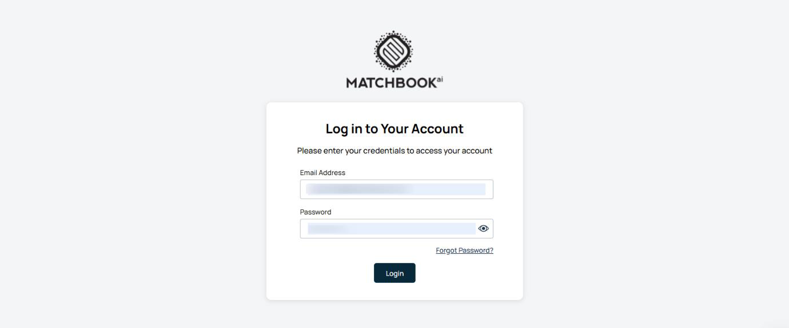
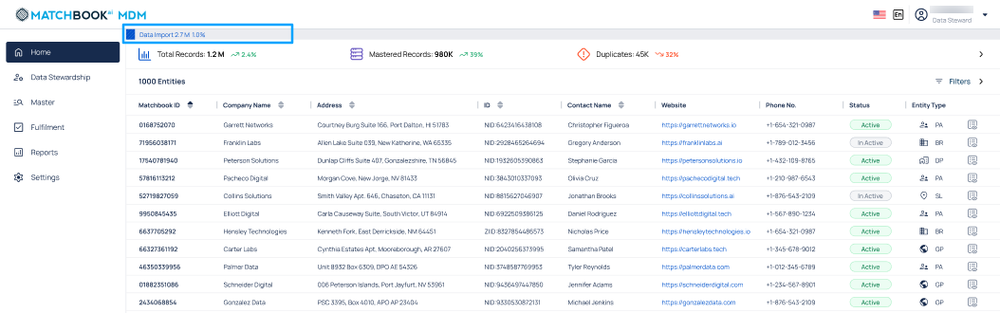

1. Home 
----

The dashboard offers a real-time overview of key metrics to monitor system performance and data quality. Designed with a data-forward approach, it provides instant visibility into your data’s health, performance, and trends. 

On the top-right corner of the screen, you'll find a **flag icon** indicating the current **locale** settings- in this case, **US English**. This signifies that the application is currently configured for users in the United States, using English as the language.  

Next to the flag, you'll see the **name and role** of the logged-in user (in this case, Name of the user and Data Steward). Clicking on this icon will open a dropdown menu with the **Logout** option.  

1.1 Process Indicator
^^^^^^^^^^^^^^^^^^^^^^

The **Process Indicator** provides users with real-time updates on the status of key background operations. It is designed to enhance transparency and user awareness during data-related workflows. 

The indicator monitors and displays the progress of the following critical processes: 

* **Import**: Displays the current status of active data import operations. 

* **Data Mastering**: Shows real-time progress for data mastering tasks, including matching, deduplication, and enrichment. 

* **Export**: Indicates the status of ongoing data export activities. 

Each active process will include: 

* **Process Name**: Clearly labeled (e.g., Import, Data Mastering, Export). 

* **Completion Percentage**: Displays a numeric value indicating how much of the process has been completed (e.g., 65%). 

* **Progress Bar**: A visual representation of completion status that dynamically fills based on progress. 

Right from the **Home Screen**, you get a real-time snapshot of your data ecosystem that displays key performance indicators (KPIs) such as **Total Records**, **Mastered Records**, and **Duplicates**-each showing value trends that highlight increases or decreases over time.  
