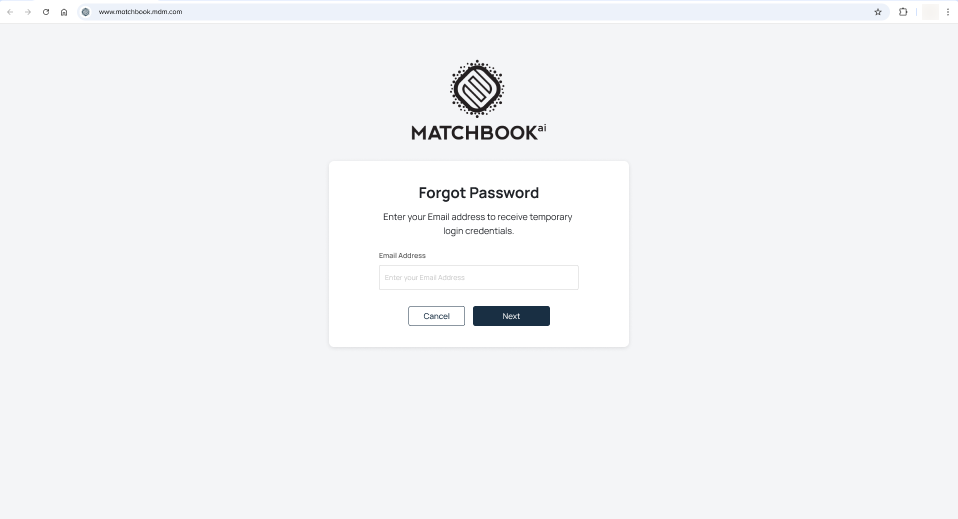
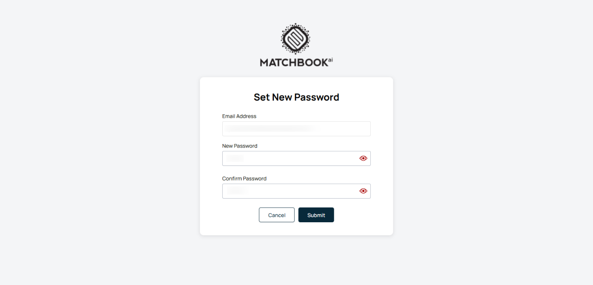
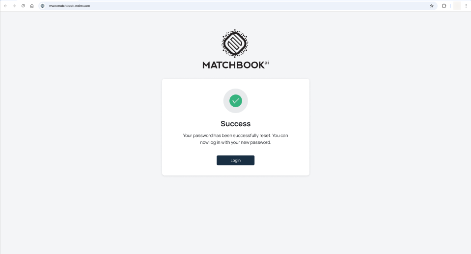

1. Home 
-------

The dashboard offers a real-time overview of key metrics to monitor system performance and data quality. Designed with a data-forward approach, it provides instant visibility into your data’s health, performance, and trends. 

On the top-right corner of the screen, you'll find a **flag icon** indicating the current **locale** settings- in this case, **US English**. This signifies that the application is currently configured for users in the United States, using English as the language.  

Next to the flag, you'll see the **name and role** of the logged-in user (in this case, Name of the user and Data Steward). Clicking on this icon will open a dropdown menu with the **Logout** option.  

1.1 Process Indicator
^^^^^^^^^^^^^^^^^^^^^

The **Process Indicator** provides users with real-time updates on the status of key background operations. It is designed to enhance transparency and user awareness during data-related workflows. 

The indicator monitors and displays the progress of the following critical processes: 

* **Import**: Displays the current status of active data import operations. 

* **Data Mastering**: Shows real-time progress for data mastering tasks, including matching, deduplication, and enrichment. 

* **Export**: Indicates the status of ongoing data export activities. 

Each active process will include: 

* **Process Name**: Clearly labeled (e.g., Import, Data Mastering, Export). 

* **Completion Percentage**: Displays a numeric value indicating how much of the process has been completed (e.g., 65%). 

* **Progress Bar**: A visual representation of completion status that dynamically fills based on progress. 

Right from the **Home Screen**, you get a real-time snapshot of your data ecosystem that displays key performance indicators (KPIs) such as **Total Records**, **Mastered Records**, and **Duplicates**-each showing value trends that highlight increases or decreases over time. 

.. list-table::
    :header-rows: 1

    * - Field
      - Description
    * - Total Records
      - Displays the total number of records added to the system.
    * - Mastered Records
      - Shows the count of records that have been matched, merged, and enriched into a master entity.
    * - Duplicates
      - Indicates the number of records identified as duplicates during the data mastering process.

1.2 Expanded View for Detailed Insights 
^^^^^^^^^^^^^^^^^^^^^^^^^^^^^^^^^^^^^^^

Click the **expand icon** as shown in the screen below to unlock additional insights. Expanding the ticker bar reveals a **detailed dashboard** with visual reports that provide key data insights. 

.. figure:: images/7.png

The table below gives the description of each insight: 

.. list-table::
    :header-rows: 1

    * - Insight Area
      - Description
      - Details Displayed
    * - Geographical Distribution
      - Visualizes how records are distributed across different countries. The top 5 countries are shown individually, while the rest are grouped under "Others" for clarity.
      - when you hover on each country, you will see:

        * **Country Name**: Name of the country represented

        * **Record Count**: Number of records per country  

        * **Percentage of Total**: Share of each country’s records within the total dataset

    * - Industry Distribution
      - Highlights the composition of records based on their industry classification to help identify dominant sectors.
       
      - * **Industry Name**: The specific industry (e.g., Finance, Retail). 
        
        * **Percentage Share**: Proportion of total records within each industry.

    * - Company Size Distribution
      - Breaks down entities by their size and structural type to help understand customer or data composition.

      - * **Structure: Single**-location vs. Group companies 

        * **Size Segments**: Small, Medium, Large  

        * **Record Count & Percentage**: Number and percentage of entities within each category

    * - Data Quality Metrics
      - Offers insights into the overall quality and completeness of the dataset.

      - * **Average Addresses per Company**: Mean number of addresses associated with each entity  

        * **Completeness Score**: Percentage score reflecting how complete the record fields are across the dataset

**Note**:  

* If no data is available then a message appears: **“No records available to display”**.

* If there is Incomplete data then it displays “--” for missing data. 

 

The number of entities- up to **1,000 mastered records**—is displayed at the top, with their corresponding details presented in a structured **tabular format** for easy review and analysis. Each record includes fields such as **Matchbook ID**, **Company Name**, **Address**, **ID**, **Contact Name**, **Website**, **Phone Number**, **Status**, and **Entity** Type. A **single**, **unified filter** is available to help users quickly narrow down results based on **ID and company** details.  

.. list-table::
    :header-rows: 1

    * - Field
      - Description
    * - Matchbook ID
      - Unique system-generated ID assigned to the master record for tracking and integration purposes.
    * - Company Name
      - The official registered name of the company or entity.
    * - Address
      - Physical location(s) associated with the company.  
        **Note**: A company can have multiple addresses.
    * - ID
      - One or more unique identifiers associated with the entity.  
        List of Identifiers:

        * National ID (NID)

        * Account ID (AID)  

        * Customer ID (CID)

        * Finance ID (FID)

        * Supplier ID (SID) 

        * Registration Number

        * DUNS No.

        **Note**: There could be multiple IDs from different sources.
    * - Contact Name
      - The name of the primary contact person associated with the company.
    * - Website
      - The company's official website URL.
    * - Phone no.
      - The primary contact number for the company.
    * - Status
      - Indicates the current state of the master record (e.g., active or inactive).
    * - Entity Type
      - Displays business classification along with an entity type symbol 

        * SL - Single Location  

        * BR - Branch  

        * GP - Global Parent

        * DP - Domestic Parent 

        * HQ - Headquarters  

        * PA - Parent

**Note**:  

* Pagination will initially display the first 20 records. Users can click the **“>”** button to view the next 20 records or the **“<”** button to navigate back to the previous 20 records. The system displays **pagination controls** when the number of results exceeds the visible limit, allowing users to navigate between pages and choose the number of records displayed per page. 

* If the data fails to load, a message: "Failed to load mastered records. Please try again." Is displayed. 

* The missing column entries will be displayed by a blank space. 

* If navigation to Company Details fails, an error message: "Unable to open company details. Please try again later." is shown up. 

1.3 Filters 
^^^^^^^^^^^

Click on the **Filters** expand icon to access advanced filtering options. As a **Data Steward** or **Administrator**, you can apply filters to the Mastered Records table to **quickly find specific records based on key criteria**, helping streamline data review and decision-making.

Users should be able to filter by following fields: Matchbook ID, Company Name, Address, City, State, Country, Postal code, ID, ID Type, Status, Entity Type. 

.. figure:: images/10.png

The applied filters will be visible, allowing you to review and verify the filtering criteria used. This helps in refining searches, adjusting if necessary, and ensuring that the displayed data accurately matches the specified conditions. Once all necessary details are entered, click **Apply Filter** to update the results based on your criteria.  

.. figure:: images/11.png

 You can now see the results displayed in a tabular format, where each row represents a unique mastered record. The table is structured to provide a clear, organized view of key data attributes such as Matchbook ID, Company Name, Address, ID, Contact Name, Website, Phone No., Status, and Entity Type. This layout ensures easy comparison, efficient scanning, and quick access to essential business information for analysis and decision-making.  

 .. figure:: images/12.png

**Note**: If no records match the applied filters, a message is displayed: 
 **"No mastered records found for the selected filters."** 

When the user clicks/hover on a row (excluding the **Matchbook ID**), a compact view comes up otherwise select the **View Record** button, a **side panel** will appear, presenting detailed information about the selected entity.

.. figure:: images/13.png

The side panel will include the following sections: 

.. list-table::
    :header-rows: 1

    * - Field
      - Description
    * - Company Overview
      - This section provides a quick snapshot of the selected company, highlighting essential metadata (such as Company Name, Matchbook ID, Status, Entity Type, Last Update) for identification and record tracking.  
        
        * **Company Name**: Official registered name of the entity. 

        * **Matchbook ID**: Unique internal identifier assigned by Matchbook AI.

        * **Status**: Indicates whether the record is Active or Inactive.  

        * **Entity Type**: Classification of the entity (e.g., Global Parent, Branch, HQ).

        * **Last Update**: Timestamp showing the most recent update to the record.

    * - Primary Address
      - Shows the official, primary address of the company along with an interactive map. Useful for verifying location or for quick geographical context.  
        
        * **Primary Address**: Full street address, including city, state, and ZIP/postal code.  

        * **Map Link**: A clickable link or embedded map that redirects to Google Maps when clicked for location visualization.

    * - Contact Profiles
      - Displays alternative names or key contact identifiers tied to the company, along with certification badges if applicable.  
        
        * **Type**: Identifies the nature of the contact detail (e.g., Primary Name, Alternate Name).

        * **Value**: The actual name or contact identifier.  

        * **Cert Code**: Badge or label indicating data quality or certification level (e.g., Diamond, Platinum).

        * **Sorting**: User can click on column headers to sort by that attribute.

    * - Included Companies
      - Displays any subsidiaries, branches, or related legal entities included within the selected master record.  
        
        * **Matchbook ID**: Unique Matchbook identifier for each included entity.  

        * **Company Name**: Name of the associated or included company.

        * Sorting is available for better navigation.

**Note**: 

* If detailed data fails to load, a message is displayed: **"Failed to load record details. Please try again."**

* If history data fails to load, a message is displayed: **"Failed to load record history. Please refresh the panel."**

* If map integration fails, a message is displayed: **"Map not available."**

1.4 View Full Details 
^^^^^^^^^^^^^^^^^^^^^

By clicking on **View Full Details**, users can access a comprehensive Company profile and also includes in-depth information such as the company’s **key executives**, **corporate structure**, **official identifiers**, a list of **included or related companies**, and a full **audit trail** of actions performed on the entity—providing a complete picture for governance, compliance, and analysis. 

.. figure:: images/14.png

**Note**: If detailed data fails to load, displays a message: **“Failed to load record details. Please try again.”** 

When the View Full Details is clicked, the below screen shows up. 

.. figure:: images/14-1.png

.. list-table::
    :header-rows: 1

    * - Field
      - Description
    * - Company Name
      - Displays the official registered name of the entity.
    * - Company Logo
      - Shows the visual brand mark of the company, if available.
    * - Matchbook ID
      - Unique identifier assigned to the entity by the Matchbook AI system.
    * - Status - Active/Inactive
      - Indicates whether the company is currently operational.
    * - Address
      - Shows the company’s primary business address.
    * - Social Media Links
      - Provides clickable links to the company’s official social media profiles.
    * - Primary Contact
      - Shows the main point of contact for the organization.
    * - Website
      - Displays the official company website URL.
    * - Phone Number
      - Lists the main telephone number associated with the company.
    * - Primary Contact Rank/Position
      - Shows the designation or role of the listed primary contact.
    * - Year Started
      - Indicates the year the company was established.
    * - Employee Count
      - Displays the number of employees, either actual or modeled.
    * - Locations
      - Lists the company’s operational or registered office locations.
    * - Revenue Modeled
      - Displays estimated annual revenue based on third-party modeling.

**Download**: If you want to download the company details and include company records in JSON format from the View Details page, you can do so to analyze or share the data externally in a structured and standardized format.  

*Company Profile* 
""""""""""""""""

The **Company Profile** tab is the default landing section when a user opens a company’s detailed view. It offers a consolidated overview of the entity's foundational attributes, demographics, financials, and associated metadata.

.. figure:: images/14-2.png

**Core Company Details**: The Core Company Details section provides fundamental and high-level information about the company. This includes its official identity, contact points, website, and industry sector.  

.. list-table::
    :header-rows: 1

    * - Field
      - Description
    * - Company Name
      - The official, standardized name of the company
    * - Entity Type
      - The classification of the company within the corporate hierarchy (e.g., Single Location, Branch, Global Parent, Domestic Parent, Head Quarters).
    * - Phone Number
      - The primary telephone number associated with the entity.
    * - Website
      - The official website URL for the company.
    * - Industry
      - The primary sector or industry the business operates in, based on standard industry classifications.
    * - Competitors
      - A list of peer or rival companies, useful for benchmarking or market intelligence purposes.

**Crosswalk**: Displays the source systems from which the company data was aggregated or matched, providing traceability and multi-source reconciliation. 

.. list-table::
    :header-rows: 1

    * - Field
      - Description
    * - Crosswalk Name
      - The name of the originating system (e.g., Salesforce, D&B, ZoomInfo)
    * - ID
      - The corresponding unique identifier from that source system.

**Company Demographics**: The **Company Demographics** section offers essential background information about the company’s history, structure, and size. 

.. list-table::
    :header-rows: 1

    * - Field
      - Description
    * - Founding Date
      - The official year or date when the company was established.
    * - Company Age
      - Automatically calculated based on the founding date.
    * - Employee Count (Actual)
      - The current number of full-time and part-time employees, where available.
    * - Company Type
      - Describes the operational nature of the entity (e.g., Private, Public, Non-Profit).
    * - Ownership Type
      - Indicates whether the company is independently owned, a subsidiary, or part of a group.
    * - Legal Structure
      - Defines the company’s legal form (e.g., LLC, Corporation, Partnership).

**Location Details**: Displays the company’s physical presence and mailing-related addresses. An interactive map feature may be provided for the primary address.

.. list-table::
    :header-rows: 1

    * - Field
      - Description
    * - Type
      - Identifies if the address is Primary, Secondary, or Mailing.
    * - Primary Address
      - The main business location of the company.
    * - Secondary Address
      - An additional physical or operational location.
    * - Mailing Address
      - Official address for postal correspondence.
    * - Google Maps Link
      - A clickable link that opens the Primary Address location in Google Maps. Useful for visual verification and logistics.

**Financial Performance**: Provides insight into the company's estimated or reported financial data. 

.. list-table::
    :header-rows: 1

    * - Field
      - Description
    * - Annual Revenue (Modeled)
      - An estimated or reported revenue figure, often based on modeling where direct reporting is unavailable.
    * - Fiscal Year End
      - The closing month of the company’s financial year.
    * - Last Report Dated
      - The most recent date when the financial data was updated or confirmed.

*Key Executives* 
""""""""""""""

The **Key Executives** section highlights major decision-makers and organizational leadership linked to the entity. This helps identify contacts for outreach, verification, or enrichment. 

.. figure:: images/14-3.png

.. list-table::
    :header-rows: 1

    * - Field
      - Description
    * - Name
      - Full name of the executive
    * - Position
      - Title/role within the organization
    * - Profile Logo
      - Optional visual logo or avatar if available
    * - Sources
      - The data providers from which this executive information was sourced (ex: D&B, ZoomInfo).

**Note**: Columns are sortable to allow users to prioritize or group executives by role or importance.  

*Corporate Structure* 
""""""""""""""""""""

The **Corporate Structure** tab visualizes and lists the company’s relationship within its broader entity hierarchy. Users can explore upstream (parent) and downstream (subsidiary) entities.  

Hierarchy Tree View is a visual map showing parent-child relationships.

.. figure:: images/14-4.png

.. list-table::
    :header-rows: 1

    * - Field
      - Description
    * - Search by Company
      - Search functionality to locate related entities in the hierarchy.
    * - Select by Entity Type
      - Filter the structure by entity types (e.g., GP, SL, DP).

*Identifiers* 
""""""""""""

The **Identifiers** section contains a catalog of known unique identifiers tied to the entity, providing traceability across systems and third-party providers. 

.. figure:: images/14-5.png

.. list-table::
    :header-rows: 1

    * - Field
      - Description
    * - Type
      - Identifier category (e.g., DUNS, Tax ID, CRM ID).
    * - ID
      - The actual identifier value.
    * - Date
      - The timestamp when the identifier was last verified or updated.

Included Companies 
""""""""""""""""""

This section lists all companies that have been merged into the current master record, usually through deduplication or hierarchy-building processes.  

.. figure:: images/14-6.png

.. list-table::
    :header-rows: 1

    * - Field
      - Description
    * - Matchbook ID
      - Unique system-generated ID assigned to the master record for tracking and integration purposes.
    * - Company Name
      - The official registered name of the company or entity.
    * - Address
      - Physical location(s) associated with the company.  
        **Note**: A company can have multiple addresses.
    * - ID
      - One or more unique identifiers associated with the entity.  
        List of Identifiers:  

        * National ID (NID) 

        * Account ID (AID)  

        * Customer ID (CID)

        * Finance ID (FID)  

        * Supplier ID (SID)
        
        * Registration Number
        
        * DUNS No.  
        **Note**: There could be multiple IDs from different sources.
    * - Contact Name
      - The name of the primary contact person associated with the company.
    * - Website
      - The company's official website URL.
    * - Phone no.
      - The primary contact number for the company.
    * - Status
      - Indicates the current state of the master record (e.g., active or inactive).
    * - Entity Type
      - Displays business classification along with an entity type symbol 

        * SL- Single Location  

        * BR- Branch  

        * GP- Global Parent 

        * DP- Domestic Parent 

        * HQ- Headquarters 

        * PA- Parent

    * - Actions
      - **Unmerge Action** – Allows the user to initiate unmerge request.

Audit Trials 
""""""""""""

The Audit Trails section maintains a detailed log of all actions performed on the company record, providing transparency and accountability. 

.. figure:: images/14-7.png

.. list-table::
    :header-rows: 1

    * - Field
      - Description
    * - Timestamp
      - When the action was performed.
    * - Entity Type
      - Nature of the action (e.g., Merge, Update, Unmerge).
    * - User
      - Username or system agent responsible for the change.
    * - Details
      - Summary of what was modified or executed.

1.5 View History 
^^^^^^^^^^^^^^^^

Clicking on the **View History** feature allows users to track and audit the sequence of historical changes performed on a mastered entity record. This enhances transparency and supports data governance by showing how the entity has evolved over time.

.. figure:: images/14-8.png

Once opened, the history view displays a chronological list of key actions performed on the entity. Each entry includes: 

.. list-table::
    :header-rows: 1

    * - Field
      - Description
    * - Action Type
      - Indicates the kind of action taken (e.g., Profile Merged, Entity Merged, Entity Unmerged).
    * - Timestamp
      - Date and time when the action occurred.
    * - Related Entity
      - If applicable, shows the name or ID of the entity involved in the action.

.. figure:: images/14-9.png

**Note**: 

* **Back Button**: Located within the View History panel, this returns the user to the main **Detailed View** of the record. 

* **View Full Details** Button: Available within each history entry or at the top of the history panel, this button provides deeper insight into the entity’s full profile and attributes at the time of the historical change. 

* If history data fails to load, display: *"Failed to load record history. Please refresh the panel."*
 