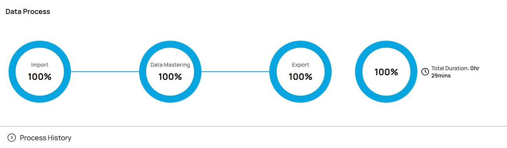
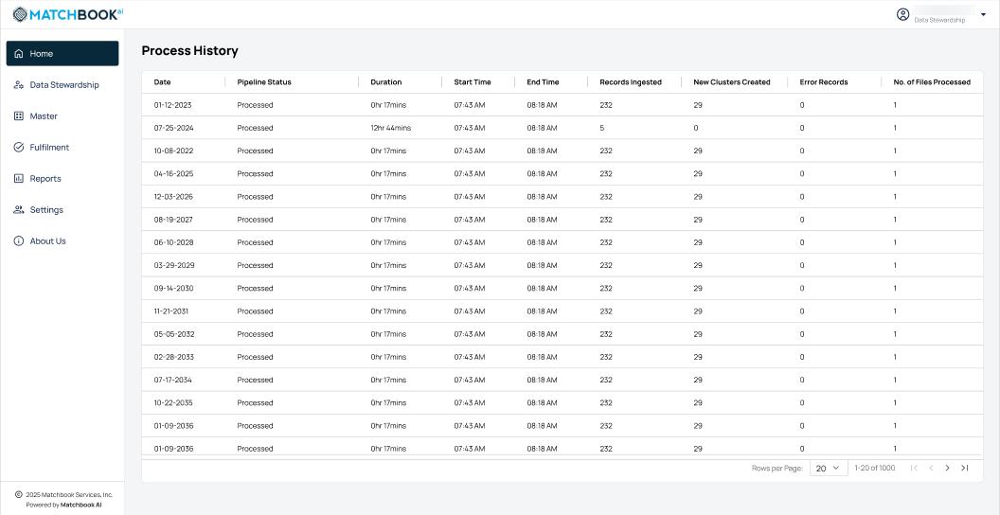

1. Home 
---------

The dashboard provides an overview of key real-time metrics to monitor system performance and data quality.

.. list-table::
    :header-rows: 1

    * - Field
      - Description
    * - Total Records Ingested
      - Displays the total number of records added to the system.
    * - Total Mastered Records
      - Shows the number of records successfully mastered.
    * - Potential Duplicates
      - Records that are likely duplicates based on matching logic and need validation.

1.1 Last 30 Days Statistics 
^^^^^^^^^^^^^^^^^^^^^^^^^^^

Presents statistics for the past 30 days, each paired with a visual icon for easy identification and trend indicators to monitor changes, providing a clear snapshot of data trends and system activity at a glance.

.. list-table::
    :header-rows: 1

    * - Field
      - Description
    * - New Records Ingested
      - The total number of new records ingested into the system for the last 30 days (from yesterday), with comparisons to the prior 30-day period to track changes in ingestion rates.
    * - New Clusters Created
      - The total number of new clusters created during the last 30 days (from yesterday), compared with the prior 30-day period to identify trends.
    * - Error Records
      - The number of records flagged with errors or inconsistencies during the last 30 days (from yesterday), compared with the 30-day period prior.
    * - Files Processed
      - The total number of files processed by the system during the last 30 days (from yesterday), compared with the prior 30-day period.

1.2 Monitoring the ETL Pipeline
^^^^^^^^^^^^^^^^^^^^^^^^^^^^^^^^

This section provides users with an overview of the ETL pipeline processing statistics. 

**Note**: This pipeline can be triggered on-demand or automatically when files are ingested into the designated S3 buckets. All data processed through this pipeline is extracted from licensed sources.

Users can monitor progress across critical stages. Hover over each stage to reveal tooltips with essential details such as when the stage **Started**, when it will **End**, **Duration** and what is the **Current Status** of the stage the file is in.

* **Import**: Whenever there is a new file imported, it will trigger the ETL pipeline. 

* **Data mastering**: involves identifying and consolidating multiple records belonging to the same entity. **For instance**, if there are four products linked to a single company, three of these may be considered potential duplicates. Through the mastering process, these records are unified into a single, accurate record. Clustering plays a crucial role by grouping similar products together, enabling effective mastering. The clustering process brings all related records together, while the user makes the final decision on which records to master.

* **Export**: reflects the status of the file. 

* **Total Duration**: Total duration of the ETL pipeline.

A **.csv** file is imported from the external systems or users, and the file is validated against the given criteria and when the data processing is finished, the file is available for export or download.

1.3 Process History
^^^^^^^^^^^^^^^^^^^^

The **Process History** section provides a detailed chronological overview of data pipeline executions, offering transparency and insight into each step of the process. This comprehensive summary allows users to monitor pipeline performance, track key metrics, and identify any potential issues quickly.

To view the process history, expand the **Process History** section located below the ETL pipeline visualization.

.. figure:: images/16.png

Click on the **Show More** button. 

.. figure:: images/17.png

When you click on it, a new page opens displaying the detailed process history page, where you can explore additional insights and historical data. 

This section serves as a vital tool for operational analysis, for more information refer to the table below.

.. list-table::
    :header-rows: 1

    * - Field
      - Description
    * - Date
      - Captures the specific date when the pipeline was executed.
    * - Pipeline Status
      - Indicates the completion state of the pipeline (e.g., Success, Failure).
    * - Duration
      - Shows the total time taken for the pipeline execution, allowing performance tracking and optimization.
    * - Start Time
      - Marks the exact beginning of the pipeline process.
    * - End Time
      - Marks the completion of the pipeline process.
    * - Records Ingested
      - Displays the number of data records successfully ingested during the pipeline run.
    * - New Clusters Created
      - Highlights the number of new clusters generated, reflecting system updates or reorganizations.
    * - Error Records
      - Lists the count of records that encountered issues during processing, aiding in troubleshooting and corrections.
    * - No. of Files Processed
      - Reflects the total files handled in the pipeline run for clarity on workload management.

