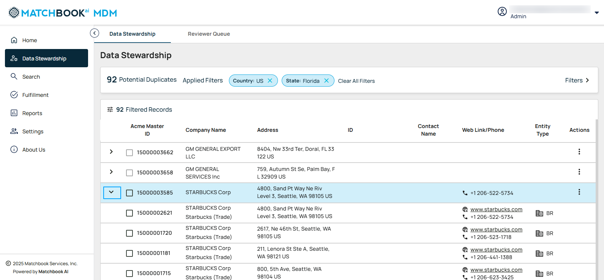
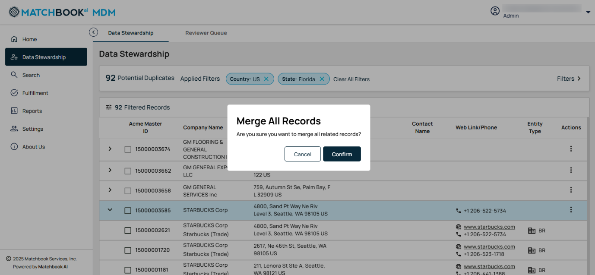
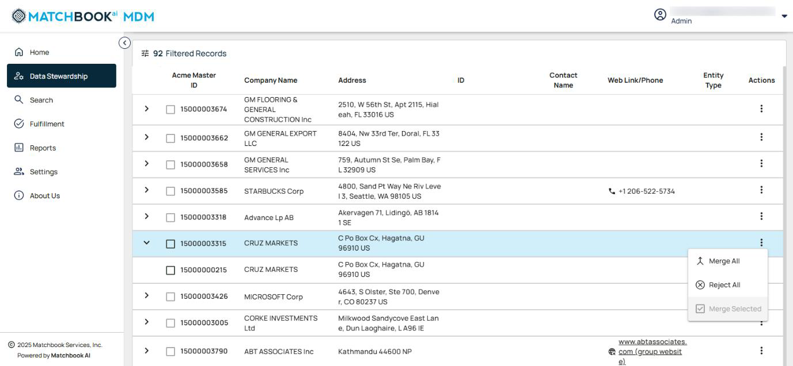

Master 
------

With MatchbookAI’s **Master** module, you can seamlessly ingest data from batch or streaming sources, then **standardize and cleanse** it to ensure quality. Using **AI-driven logic**, the platform identifies and merges duplicates, creating a unified view. It gives you clean and consolidated data, to power smarter decisions and analytics across your platforms. 

The **Master Data** feature is also designed to master and streamline your data retrieval process, allowing you to quickly locate and filter information with ease. Its intuitive layout ensures efficient navigation and precise results. Navigate to **Master** from the left-side menu. 

You can also search for data directly from the global **search on the home page**—a quick and convenient way to find what you need without navigating through menus." 

You can search by company data or click on the **All-Records** dropdown menu to select a record. Click **Download Results** and choose the option to download the results. **Saved and Recent Searches** will be displayed, and the **Search** button will show the active search criteria.

By clicking on the **Filters** expand icon, you will see various fields that allow you to search for records.

The table below describes each fields ; 

.. list-table::
   :header-rows: 1

   * - Field
     - Description
   * - Company Name
     - The official name of the business or organization in the record.
   * - Address Line
     - The primary street address or physical location of the entity.
   * - Phone Number
     - The contact telephone number associated with the company or record.
   * - City
     - The city where the business or contact is located.
   * - State/Territory
     - The specific state, province, or region tied to the entity’s address.
   * - Postal Code
     - The ZIP or postal code corresponding to the address of the entity.
   * - Country
     - The nation where the business or contact is based.
   * - Matchbook ID
     - A unique identifier automatically assigned by Matchbook AI to each record.
   * - ID
     - An external or internal reference ID tied to the source system or dataset.
   * - Status
     - Indicates the current state of the record (e.g., active, matched, rejected).
   * - Entry
     - Represents an individual data record within the system.

Once the required fields are selected, click **Apply Filters**. 

Here, filters such as **Country** (e.g., USA) and **Entity** (e.g., Parent) are selected.

.. figure:: images/28.png

The selected filters are displayed, and the results are shown based on those filters, as seen in the screen below. 

Clicking the **Saved and Recent Searches** tooltip icon opens a window titled **My Searches**, which contains two tabs: **Saved Searches** and **Recent Searches**. 

**Saved Searches** provide quick access to previously saved search criteria (For example: Entity Type, Status, US IT Organizations, Companies in Florida, and Status: Inactive).

.. figure:: images/30.png

**Recent Searches** to review your most recent search activities (For Example: Collins Networks, Carter Labs etc).

.. figure:: images/31.png

