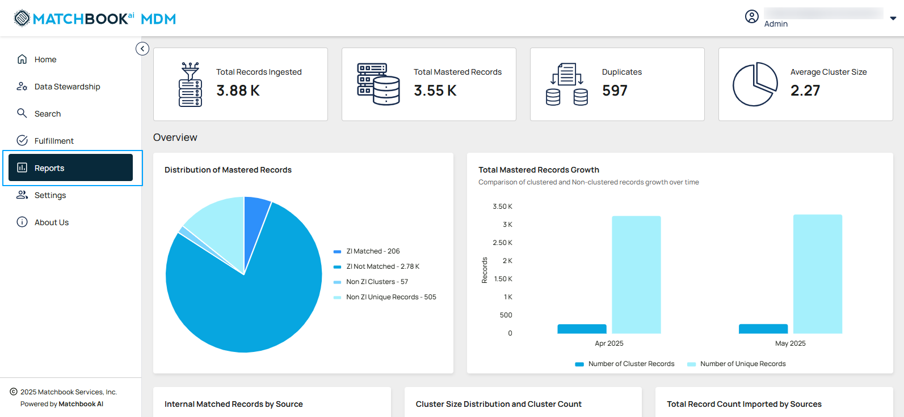
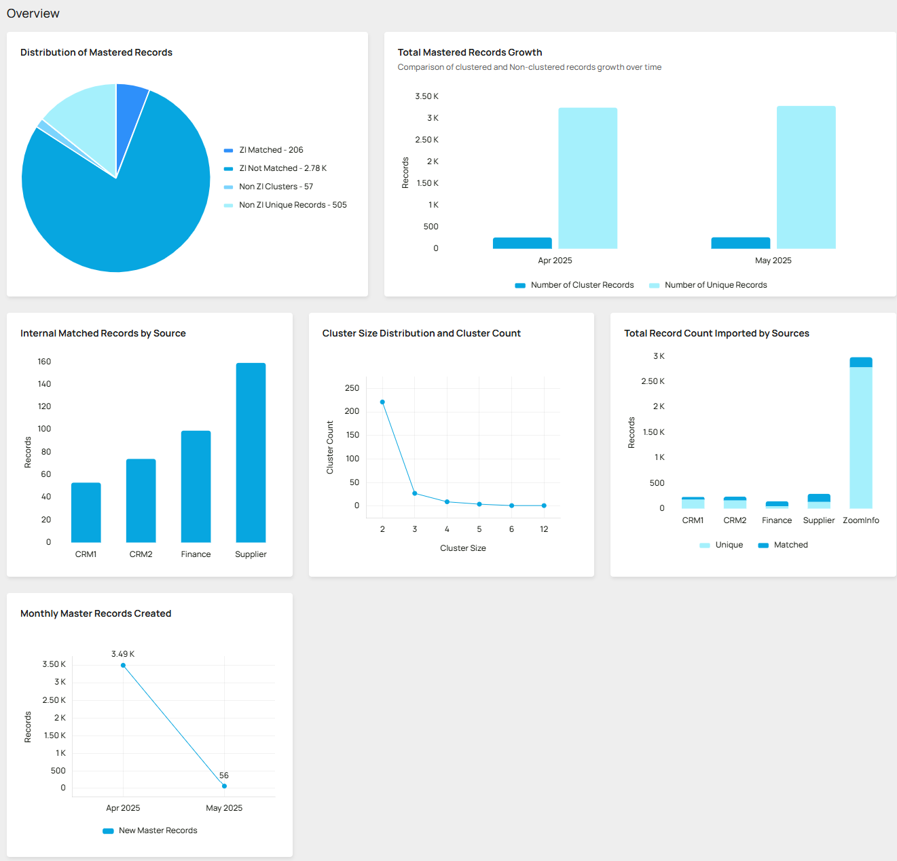
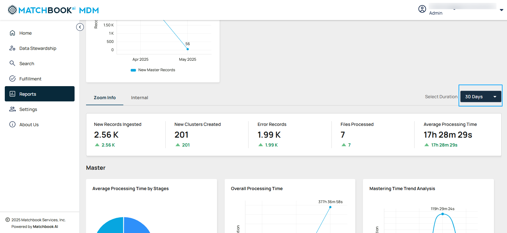
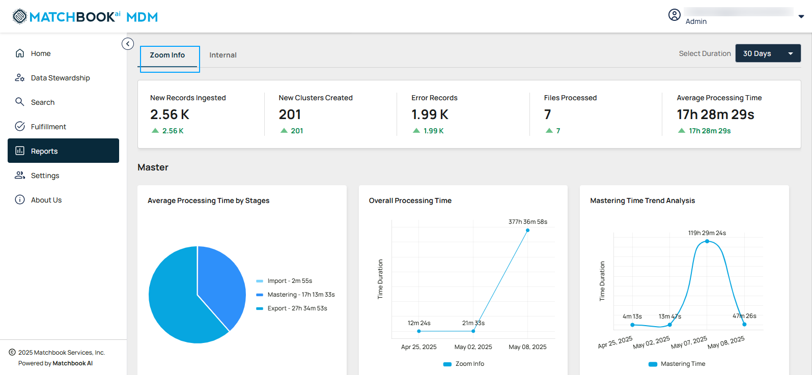
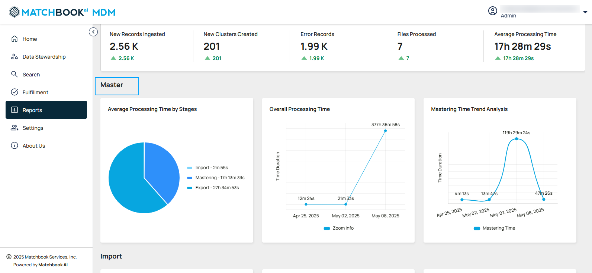
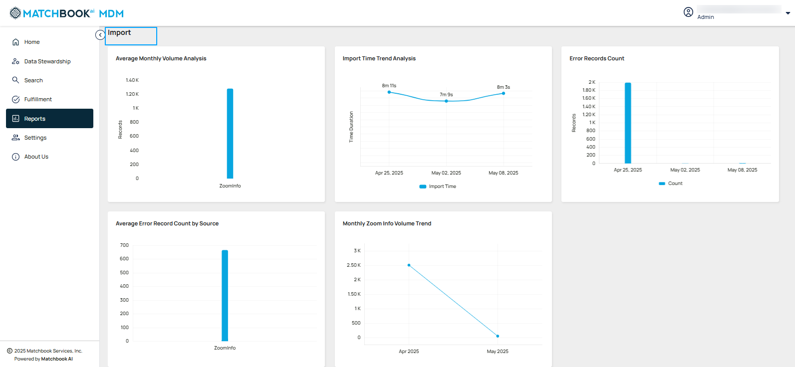
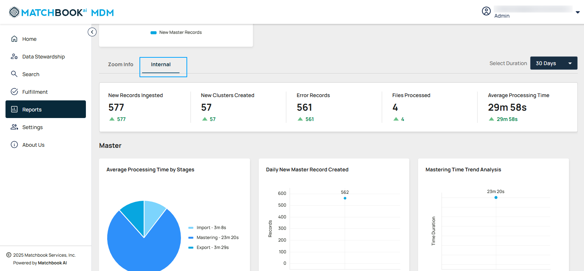
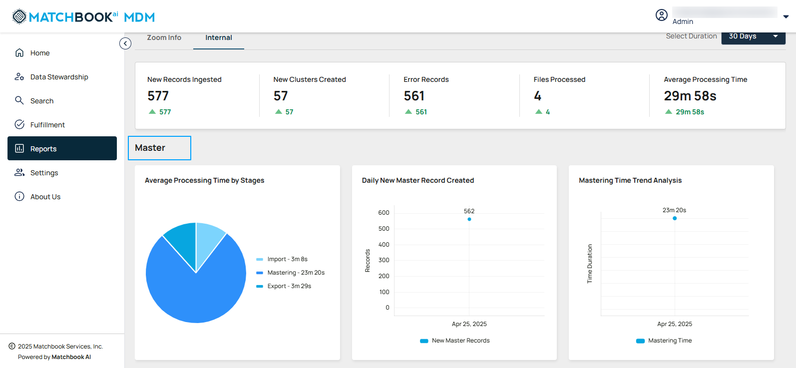
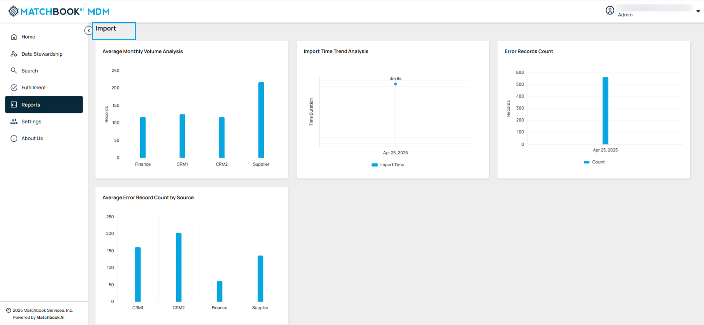

5. Reports 
-------------

Users will have access to global insights and composition charts on the Reports dashboard, providing a comprehensive summary of data processing metrics and insights over the selected duration. This enables them to explore high-level data distribution, monitor system performance, track growth trends, evaluate efficiency, and analyze relationships. To access these insights, navigate to **Reports** from the left-side menu.  

The **Reports Page** is divided into three main sections, each providing distinct insights: 

5.1 Lifetime Statistics  
^^^^^^^^^^^^^^^^^^^^^^^

Users shall have access to global insights and composition charts on the Reports dashboard, displaying high-level, aggregated statistics across all data. This provides a comprehensive overview of data distribution, growth, relationships, and overall system performance.  

 .. figure:: images/r2.png

.. list-table::
    :header-rows: 1

    * - Field
      - Description
    * - Total Records Ingested
      - Displays the total number of records imported.
    * - Total Mastered Records
      - Highlights high-quality records finalized after processing.
    * - Duplicates
      - Identifies and quantifies duplicate records detected during processing.
    * - Average Cluster Size
      - Shows the average number of records per cluster.

5.2 Overview and Metrics for Selected Duration  
^^^^^^^^^^^^^^^^^^^^^^^^^^^^^^^^^^^^^^^^^^^^^^^

**Overview**: The **Overview** section provides a comprehensive snapshot of mastered data activity and quality across the platform. It includes visual metrics and insights to help users understand the performance, trends, and integrity of their data over time. 

.. list-table::
    :header-rows: 1

    * - Metrics
      - Description
    * - Distribution of Mastered Records
      - It categorizes records by matching status, showing data quality and clustering insights.
    * - Total Mastered Records Growth
      - Bar chart depicting continuous growth of mastered records over time.
    * - Internal Matched Records by Source
      - Shows the count of matched records categorized by source (CRM1, CRM2, Finance, Supplier).
    * - Cluster Size Distribution and Cluster Count
      - Provides insights into cluster groupings.
    * - Total Record Count Imported by Sources
      - Displays the total number of records processed and categorized by individual data sources.
    * - Monthly Master Records Created
      - Tracks the number of new master records generated each month.

**Note**: **Lifetime Statistics** and **Overview** sections are same for both the tabs that is **Zoom Info** or **Internal Metrics**. 

**Select Duration**: Choose a time frame from the drop-down menu. This filters the metrics based on the selected duration, enabling detailed temporal analysis. 

**Zoom Info or Internal Metrics**: Provides metrics related to either **Zoom Info or Internal data sources**, based on the user's selection, enabling tailored insights. Switch between **ZoomInfo** and **Internal** for detailed analysis. 

5.3 Zoom Info analysis 
^^^^^^^^^^^^^^^^^^^^^^

Users will have access to detailed **Zoom Info** specific charts on the Reports dashboard for Master and Import allowing them to monitor data quality, growth, and system performance.  

**Note**: This table remains the same for **Zoom Info** and **Internal**.  

.. list-table::
    :header-rows: 1

    * - Field
      - Description
    * - New Records Ingested
      - Tracks the newly added records (e.g., 123331).
    * - New Clusters Created
      - Displays the number of new clusters formed (e.g., 1211).
    * - Error Records
      - Indicates the number of records that encountered processing errors (e.g., 1.4 K).
    * - Files Processed
      - Provides the total number of files handled (e.g., 122).
    * - Average Processing Time
      - Reflects the time taken to process data on average (e.g., 1 hr 23 m).

**Master-Specific Charts** 

.. list-table::
    :header-rows: 1

    * - Charts
      - Description
    * - Average Processing Time by Stages
      - Highlights the time spent on Import, Mastering, and Export stages.
    * - Overall Processing Time
      - Shows the total time taken for end-to-end processing.
    * - Mastering Time trend Analysis
      - Analyzes the trend of mastering times over a given period, helping to identify improvements or fluctuations in the efficiency of data mastering processes.

**Import-Specific Charts** 

.. list-table::
    :header-rows: 1

    * - Charts
      - Description
    * - Average Monthly Volume Analysis
      - It displays the record count per source name, providing insights into the monthly data volume across different sources.
    * - Import Time Trend Analysis
      - Analyzes trends in the time taken for data imports over a specific period.
    * - Error Records Count
      - Displays the count and rate of errors over time.
    * - Average Error Record Count by Source
      - Highlights the average error count per source.
    * - Monthly Zoom Info Volume Trend
      - Shows the monthly average of Zoom Info data volume.

5.4 Internal Analysis 
^^^^^^^^^^^^^^^^^^^^^^

Users will have access to detailed charts on the Reports dashboard for **Master** and **Import**, enabling them to monitor data quality, growth, and system performance for Internal sources.

.. list-table::
    :header-rows: 1

    * - Field
      - Description
    * - New Records Ingested
      - Tracks the newly added records.
    * - New Clusters Created
      - Displays the number of new clusters formed.
    * - Error Records
      - Indicates the number of records that encountered processing errors.
    * - Files Processed
      - Provides the total number of files handled.
    * - Average Processing Time
      - Reflects the time taken to process data on average.

**Master-Specific charts**: 

.. list-table::
    :header-rows: 1

    * - Field
      - Description
    * - Average Processing Time by Stages
      - Visualizes the time spent in each stage—Import, Mastering, and Export—with durations measured in minutes.
    * - Daily New Master Record Created
      - Tracks the number of new high-quality, mastered records created on a daily basis.
    * - Mastering Time Trend Analysis
      - Analyzes the trend of mastering times over a given period, helping to identify improvements or fluctuations in the efficiency of data mastering processes.

**Import-Specific Charts**

.. list-table::
    :header-rows: 1

    * - Field
      - Description
    * - Average Monthly Volume Analysis
      - Visualizes the average monthly record volume per source.
    * - Import Time Trend Analysis
      - Analyzes trends in time taken for data imports.
    * - Error Records Count
      - Tracks the number of errors and their occurrence rate over time.
    * - Average Error Record Count by Source
      - Highlights the average error count per source (CRM01, CRM02, Finance, and Supplier).
