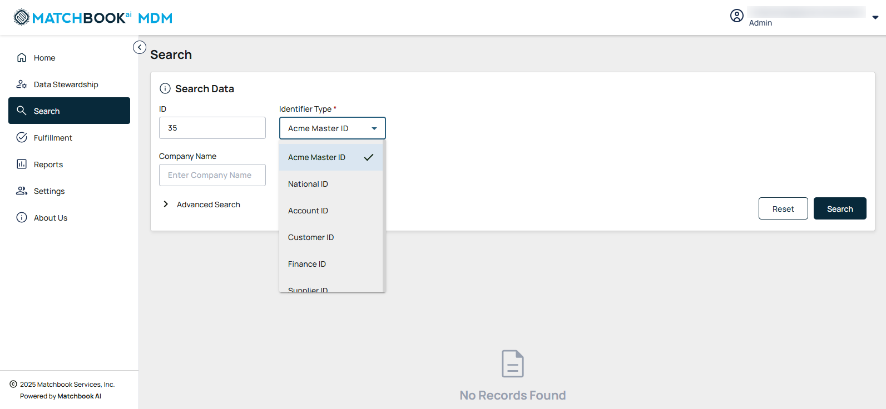
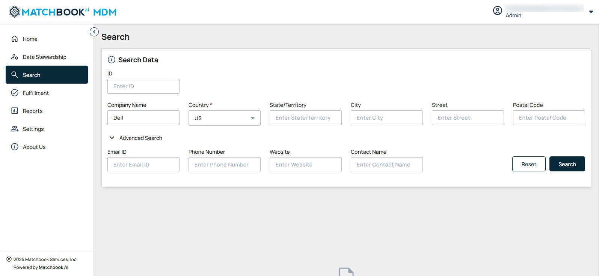

3. Search 
------------

The **Search Data** feature is designed to master and streamline your data retrieval process, allowing you to quickly locate and filter information with ease. Its intuitive layout ensures efficient navigation and precise results. Navigate to **Search** from the left-side menu.

The information icon (ⓘ) beside Search Data displays the valid values to be entered before proceeding with the search.  

**Note**: Enter valid values in any of the search fields below to proceed. 

1. ID or Company Name (or) 

2. ID and ID Type or Company Name and Country (or) 

3. Email ID or Website or Phone Number or Contact Name 

There are three ways to search for data which is mandatory. 

1. **By ID**  

Users can search the data by ID. The Identifier Type is a mandatory input value when searching. Once the user enters the ID this field shows up. Users can select the appropriate Identifier Type from the list of options provided in the dropdown menu to indicate the type of ID in the search. 

2. **By Company Name** 

Users can search for data by company name. After entering the Company name additional input fields are displayed.  

The description of input fields for searching data based on Company Name has been provided in the below table. 

.. list-table::
    :header-rows: 1

    * - Field
      - Description
    * - Company Name
      - Input a company name to filter results based on associated records.  
        **Note:** Once the user enters the company name, other fields are auto populated.
    * - Country
      - Select the country from the dropdown list.  
        **Note:** This is a mandatory input when searching data by Company name.
    * - State/Territory
      - Enter the name of the state or territory.
    * - City
      - Input the city name for precise filtering.
    * - Street
      - Enter the street address for detailed searches.
    * - Postal Code
      - Provide the postal code for accurate location identification.

3. **By Advanced Search** 

Users can search for data by using **Advanced Search**. After clicking on expand icon (**˅**)  beside **Advanced Search**, additional input fields are displayed. These fields are described below.  

.. list-table::
    :header-rows: 1

    * - Field
      - Description
    * - Email
      - Enter the email address for targeted search or filtering.
    * - Phone Number
      - Input the phone number for precise contact identification.
    * - Website
      - Provide the website name to narrow down results.
    * - Contact Name
      - Enter the name of the contact person for specific records.

Click **Search**. The results will be displayed in a sortable table, allowing easy organization.

Under the **Actions** column, you can export the results as a CSV file using the **Download** button or use the **Copy** button to copy the data in JSON format.  