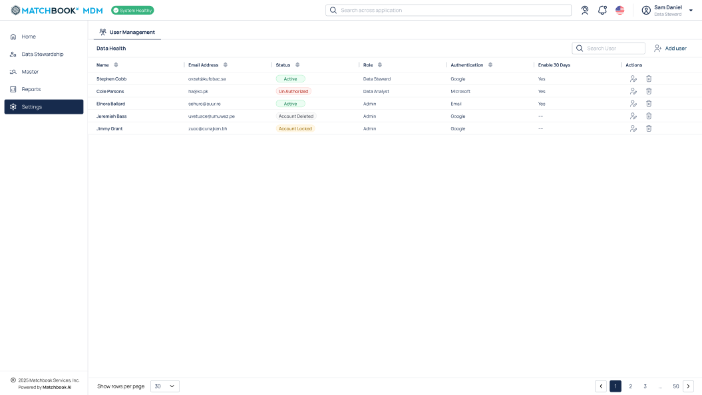

6. Settings 
-------------

This section provides tools and configurations for admins to manage users—helping maintain privacy, protect sensitive information, and control user permissions.  

If users have already been added, a list of existing users will be displayed, as shown in the screen below. 

The table below gives the description of each field 

.. list-table::
   :header-rows: 1

   * - Field
     - Description
   * - Name
     - Displays the full name of the user.
   * - Email
     - Shows the email address associated with the user account.
   * - Address
     - Indicates the user's registered or organizational address.
   * - Status
     - Reflects the current status of the user account (e.g., active, inactive).
   * - Role
     - Specifies the assigned role and access level for the user.  
   * - Data steward
     - Represents a user with permissions to manage and monitor data quality and integrity.
   * - Admin
     - Indicates administrative privileges for system-level configuration and user management.
   * - Authentication
     - Verifies user identity to ensure secure and authorized access to the system (ex: Google, Microsoft).
   * - Enable 30 days
     - Temporarily grants access to the user for a 30-day period.
   * - Actions
     - Provides options to manage user settings, such as edit or deactivate.

5.1 Add User
^^^^^^^^^^^^

Click on **+ Add** and enter the necessary details to add a user. 

5.2 Edit User 
^^^^^^^^^^^^^

To edit an existing user, click **Edit** icon (🖉) under the **Actions** column.  

5.3 Delete User 
^^^^^^^^^^^^^^^

To delete a user, click the **Delete** icon (🗑) next to their name under the **Actions** column. 
