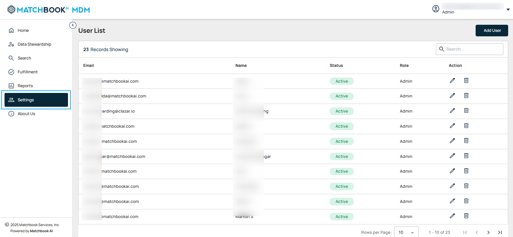
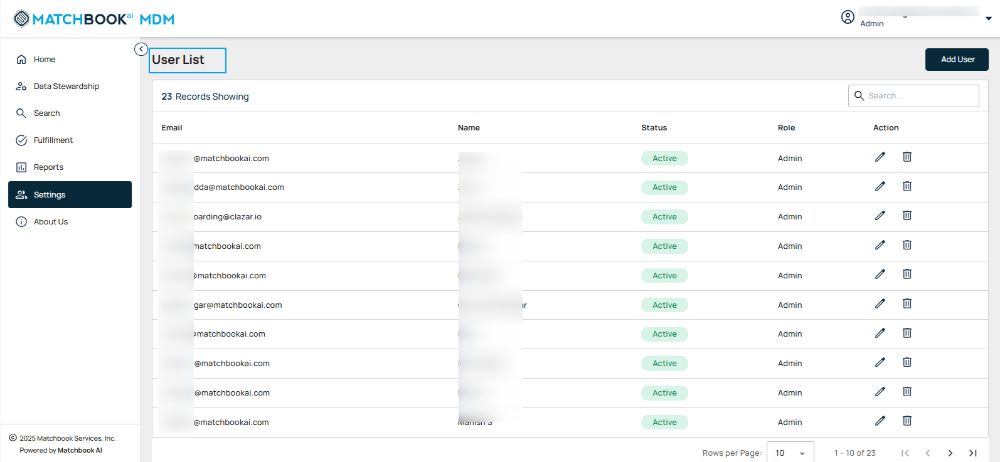
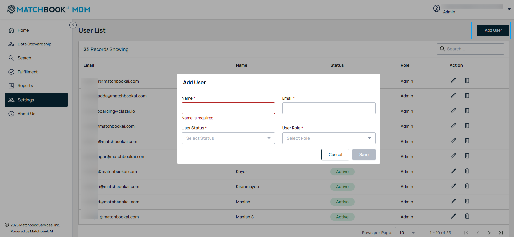
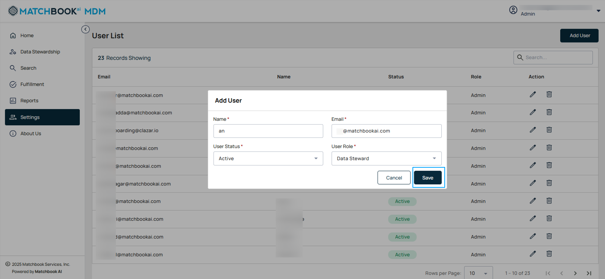
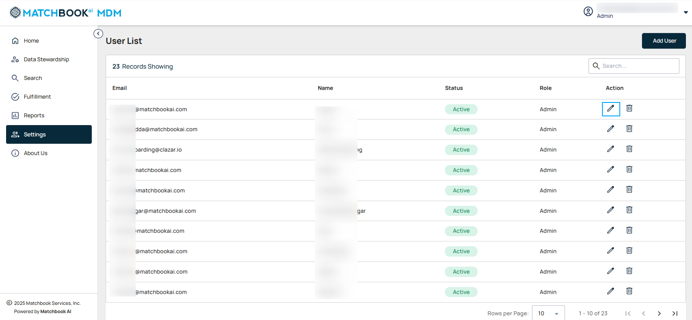
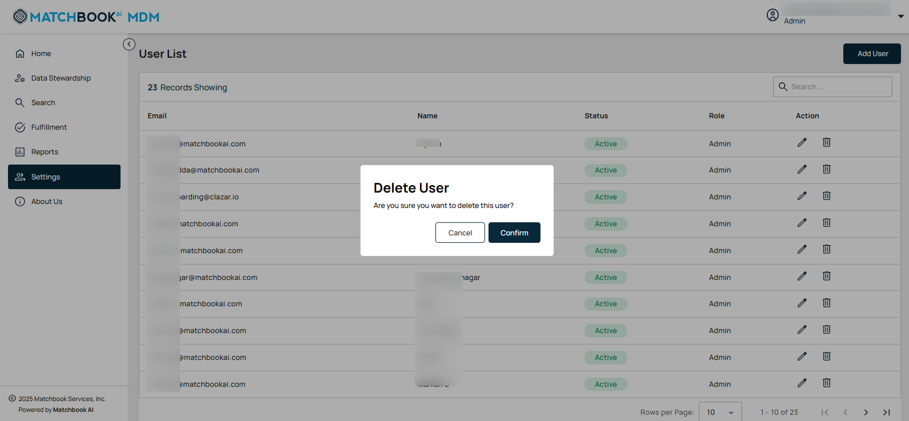

6. Settings 
--------------

The **Settings** section is designed to safeguard your data and ensure secure access to the system. This section provides tools and configurations to maintain privacy, protect sensitive information, and control user permissions. 

If users are already added, then the User list is displayed as shown in the screen below.

*6.1.1 Add User* 
""""""""""""""""
Click on **+ Add**, a pop-up window opens then enter the necessary details such as **Name, Email, User Status**, and **User Role**. 

**Note**: All fields are mandatory. 

The description of each field is given below: 

.. list-table::
    :header-rows: 1

    * - Field
      - Description
    * - Name
      - Enter the name of the user.  
        **Note:** If you enter special characters, a message will appear: “Invalid characters entered. Please use only letters.”
    * - Email
      - Enter the Email of the user.  
        **Note:** If the user's email is not valid, the message “Invalid email format. Please enter a valid email address.” will be displayed.
    * - User Status
      - Admins can activate or lock users by selecting the user status (Active, Locked) from the drop-down menu.
    * - User Role
      - From the drop-down menu, select a role (Data Steward, Admin, Fulfillment); admins will determine access permissions within the platform based on the selected role.

After entering all the details such as Name, Email, User Status, and User Role, click **Save** to add a new user.  

*6.1.2 Edit User* 
""""""""""""""""

To edit an existing user, click **Edit** icon (🖉) under the **Actions** column.   

Modify details such as **Name, Email**, and update the **User Status** and **User Role** using the drop-down menu as needed. Once done, click **Save** to apply the changes.   

*6.1.3 Delete User*
"""""""""""""""""""

To delete a user, click the **Delete** icon (🗑) next to their name under the **Actions** column. 

In the confirmation dialog that appears, click **Confirm** to proceed with the deletion. 

